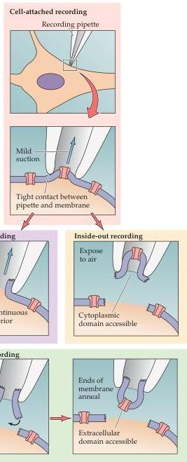

Chapter Four

# Box A

## The Patch Clamp Method

A wealth of new information about ion channels resulted from the invention of the patch clamp method in the 1970s.
This technique is based on a very simple idea.
A glass pipette with a very small opening is used to make tight contact with a tiny area, or patch, of neuronal membrane.
After the application of a small amount of suction to the back of the pipette, the seal between pipette and membrane becomes so tight that no ions can flow between the pipette and the membrane.
Thus, all the ions that flow when a single ion channel opens must flow into the pipette.
The resulting electrical current, though small, can be measured with an ultrasensitive electronic amplifier connected to the pipette.
Based on the geometry involved, this arrangement usually is called the cell-attached patch clamp recording method.
As with the conventional voltage clamp method, the patch clamp method allows experimental control of the membrane potential to characterize the voltage dependence of membrane currents.

Although the ability to record currents flowing through single ion channels is an important advantage of the cell-attached patch clamp method, minor technical modifications yield still other advantages.
For example, if the membrane patch within the pipette is disrupted by briefly applying strong suction, the interior of the pipette becomes continuous with the cytoplasm of the cell.
This arrangement allows measurements of electrical potentials and currents from the entire cell and is therefore called the whole-cell recording method.
The whole-cell configuration also allows diffusional exchange between the pipette and the cytoplasm, producing a convenient way to inject substances into the interior of a "patched" cell.

Two other variants of the patch clamp method originate from the finding that once a tight seal has formed between the

Four configurations in patch clamp measurements of ionic currents.

membrane and the glass pipette, small pieces of membrane can be pulled away from the cell without disrupting the seal; this yields a preparation that is free of the complications imposed by the rest of the cell.
Simply retracting a pipette that

is in the cell-attached configuration causes a small vesicle of membrane to remain attached to the pipette.
By exposing the tip of the pipette to air, the vesicle opens to yield a small patch of membrane with its (former) intracellular sur