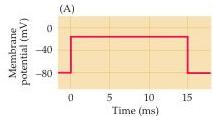
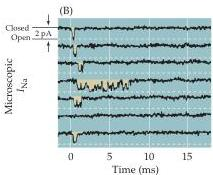
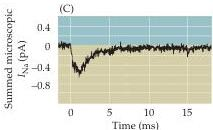
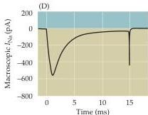
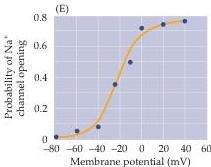

Chapter Four

Figure 4.1 Patch clamp measurements of ionic currents flowing through single  $\mathrm{Na^{+}}$  channels in a squid giant axon.
In these experiments,  $\mathrm{Cs^{+}}$  was applied to the axon to block voltage-gated  $\mathrm{K}^+$  channels.
Depolarizing voltage pulses (A) applied to a patch of membrane containing a single  $\mathrm{Na^{+}}$  channel result in brief currents (B, downward deflections) in the seven successive recordings of membrane current  $(I_{\mathrm{Na}})$ .
(C) The sum of many such current records shows that most channels open in the initial  $1 - 2\mathrm{ms}$  following depolarization of the membrane, after which the probability of channel openings diminishes because of channel inactivation.
(D) A macroscopic current measured from another axon shows the close correlation between the time courses of microscopic and macroscopic  $\mathrm{Na^{+}}$  currents.
(E) The probability of an  $\mathrm{Na^{+}}$  channel opening depends on the membrane potential, increasing as the membrane is depolarized.
(B,C after Bezanilla and Correa, 1995; D after Vandenburg and Bezanilla, 1991; E after Correa and Bezanilla, 1994.)

Several observations further proved that the microscopic currents in Figure 4.1B are due to the opening of single, voltage-activated  $\mathrm{Na^{+}}$  channels.
First, the currents are carried by  $\mathrm{Na^{+}}$ ; thus, they are directed inward when the membrane potential is more negative than  $E_{\mathrm{Na}}$ , reverse their polarity at  $E_{\mathrm{Na}}$ , are outward at more positive potentials, and are reduced in size when the  $\mathrm{Na^{+}}$  concentration of the external medium is decreased.
This behavior exactly parallels that of the macroscopic  $\mathrm{Na^{+}}$  currents described in Chapter 3.
Second, the channels have a time course of opening, closing, and inactivating that matches the kinetics of macroscopic  $\mathrm{Na^{+}}$  currents.
This correspondence is difficult to appreciate in the measurement of microscopic currents flowing through a single open channel, because individual channels open and close in a stochastic (random) manner, as can be seen by examining the individual traces in Figure 4.1B.
However, repeated depolarization of the membrane potential causes each  $\mathrm{Na^{+}}$  channel to open and close many times.
When the current responses to a large number of such stimuli are averaged together, the collective response has a time course that looks much like the macroscopic  $\mathrm{Na^{+}}$  current (Figure 4.1C).
In particular, the channels open mostly at the beginning of a prolonged depolarization, showing that they subsequently inactivate, as predicted from the macroscopic  $\mathrm{Na^{+}}$  current (compare Figures 4.1C and 4.1D).
Third, both the opening and closing of the channels are voltage-dependent; thus, the channels are closed at  $-80~\mathrm{mV}$  but open when the membrane potential is depolarized.
In fact, the probability that any given channel will be open varies with membrane potential (Figure 4.1E), again as predicted from the macroscopic  $\mathrm{Na^{+}}$  conductance (see Figure 3.7).
Finally, tetrodotoxin, which blocks the macroscopic  $\mathrm{Na^{+}}$  current (see Box C), also blocks microscopic  $\mathrm{Na^{+}}$  currents.
Taken together, these results show that the macroscopic  $\mathrm{Na^{+}}$  current measured by Hodgkin and Huxley does indeed arise from the aggregate effect of many thousands of microscopic  $\mathrm{Na^{+}}$  currents, each representing the opening of a single voltage-sensitive  $\mathrm{Na^{+}}$  channel.

Patch clamp experiments have also revealed the properties of the channels responsible for the macroscopic  $\mathrm{K}^+$  currents associated with action potentials.
When the membrane potential is depolarized (Figure 4.2A), microscopic outward currents (Figure 4.2B) can be observed under conditions that block  $\mathrm{Na}^+$  channels.
The microscopic outward currents exhibit all the features expected for currents flowing through action-potential-related  $\mathrm{K}^+$  channels.
Thus, the microscopic currents (Figure 4.2C), like their macroscopic counterparts (Figure 4.2D), fail to inactivate during brief depolarizations.
Moreover, these single-channel currents are sensitive to ionic manipu