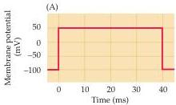
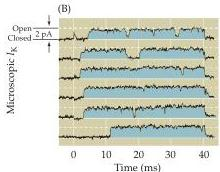
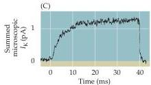
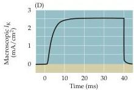
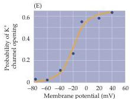

Channels and Transporters

Figure 4.2 Patch clamp measurements of ionic currents flowing through single  $\mathbf{K}^+$  channels in a squid giant axon.
In these experiments, tetrodotoxin was applied to the axon to block voltage-gated  $\mathrm{Na^{+}}$  channels.
Depolarizing voltage pulses (A) applied to a patch of membrane containing a single  $\mathbf{K}^+$  channel results in brief currents (B, upward deflections) whenever the channel opens.
(C) The sum of such current records shows that most channels open with a delay, but remain open for the duration of the depolarization.
(D) A macroscopic current measured from another axon shows the correlation between the time courses of microscopic and macroscopic  $\mathbf{K}^+$  currents.
(E) The probability of a  $\mathbf{K}^+$  channel opening depends on the membrane potential, increasing as the membrane is depolarized.
(B and C after Augustine and Bezanilla, in Hille 1992; D after Augustine and Bezanilla, 1990; E after Perozo et al., 1991.)

lations and drugs that affect the macroscopic  $\mathrm{K}^+$  currents and, like the macroscopic  $\mathrm{K}^+$  currents, are voltage-dependent (Figure 4.2E).
This and other evidence shows that macroscopic  $\mathrm{K}^+$  currents associated with action potentials arise from the opening of many voltage-sensitive  $\mathrm{K}^+$  channels.

In summary, patch clamping has allowed direct observation of microscopic ionic currents flowing through single ion channels, confirming that voltage sensitive  $\mathrm{Na^{+}}$  and  $\mathrm{K}^+$  channels are responsible for the macroscopic conductances and currents that underlie the action potential.
Measurements of the behavior of single ion channels has also provided some insight into the molecular attributes of these channels.
For example, single channel studies show that the membrane of the squid axon contains at least two types of channels—one selectively permeable to  $\mathrm{Na^{+}}$  and a second selectively permeable to  $\mathrm{K}^+$ .
Both channel types are voltage-gated, meaning that their opening is influenced by membrane potential (Figure 4.3).
For each channel, depolarization increases the probability of channel opening, whereas hyperpolarization closes them (see Figures 4.1E and 4.2E).
Thus, both channel types must have a voltage sensor that detects the potential across the membrane (Figure 4.3).
However, these channels differ in important respects.
In addition to their different ion selectivities, depolarization also inactivates the  $\mathrm{Na^{+}}$  channel but not the  $\mathrm{K}^+$  channel, causing  $\mathrm{Na^{+}}$  channels to pass into a nonconducting state.
The  $\mathrm{Na^{+}}$  channel must therefore have an additional molecular mechanism responsible for inactivation.
And, as expected from the macroscopic behavior of the  $\mathrm{Na^{+}}$  and  $\mathrm{K}^+$  currents described in Chapter 3, the kinetic properties of the gating of the two channels differs.
This information about the physiology of single channels set the stage for subsequent studies of the molecular diversity of ion channels in various cell types, and of their detailed functional characteristics.

# The Diversity of Ion Channels

Molecular genetic studies, in conjunction with the patch clamp method and other techniques, have led to many additional advances in understanding ion channels.
Genes encoding  $\mathrm{Na^{+}}$  and  $\mathrm{K}^+$  channels, as well as many other channel types, have now been identified and cloned.
A surprising fact that has emerged from these molecular studies is the diversity of genes that code for ion channels.
Well over 100 ion channel genes have now been discovered, a number that could not have been anticipated from early studies of ion channel function.
To understand the functional significance of this multitude of ion channel genes, the channels can be selectively expressed in well

