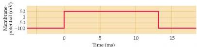
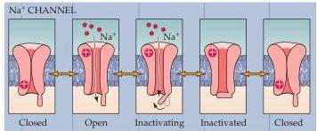
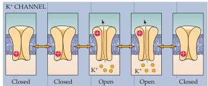

Chapter Four

Figure 4.3 Functional states of voltage-gated  $\mathrm{Na^{+}}$  and  $\mathbf{K}^+$  channels.
The gates of both channels are closed when the membrane potential is hyperpolarized.
When the potential is depolarized, voltage sensors (indicated by  $+$ ) allow the channel gates to open—first the  $\mathrm{Na^{+}}$  channels and then the  $\mathbf{K}^+$  channels.
 $\mathrm{Na^{+}}$  channels also inactivate during prolonged depolarization, whereas many types of  $\mathbf{K}^+$  channels do not.

defined experimental systems, such as in cultured cells or frog oocytes (Box B), and then studied with patch clamping and other physiological techniques.
Such studies have found many voltage-gated channels that respond to membrane potential in much the same way as the  $\mathrm{Na^{+}}$  and  $\mathrm{K}^+$  channels that underlie the action potential.
Other channels, however, are gated by chemical signals that bind to extracellular or intracellular domains on these proteins and are insensitive to membrane voltage.
Still others are sensitive to mechanical displacement, or to changes in temperature.

Further magnifying this diversity of ion channels are a number of mechanisms that can produce functionally different types of ion channels from a single gene.
Ion channel genes contain a large number of coding regions that can be spliced together in different ways, giving rise to channel proteins that can have dramatically different functional properties.
RNAs encoding ion channels also can be edited, modifying their base composition after transcription from the gene.
For example, editing the RNA encoding of some receptors for the neurotransmitter glutamate (Chapter 6) changes a single amino acid within the receptor, which in turn gives rise to channels that differ in their selectivity for cations and in their conductance.
Channel proteins can also undergo posttranslational modifications, such as phosphorylation by protein kinases (see Chapter 7), which can further change their functional characteristics.
Thus, although the basic electrical signals of the nervous system are relatively stereotyped, the proteins responsible for generating these signals are remarkably diverse, conferring specialized signaling properties to many of the neuronal cell types that populate the nervous system.
These channels also are involved in a broad range of neurological diseases.