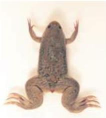
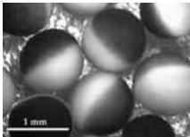
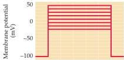
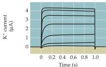

Channels and Transporters 75

# Box B

## Expression of Ion Channels in Xenopus Oocytes

Bridging the gap between the sequence of an ion channel gene and understanding channel function is a challenge.
To meet this challenge, it is essential to have an experimental system in which the gene product can be expressed efficiently, and in which the function of the resulting channel can be studied with methods such as the patch clamp technique.
Ideally, the vehicle for expression should be readily available, have few endogenous channels, and be large enough to permit mRNA and DNA to be microinjected with ease.
Oocytes (immature eggs) from the clawed African frog, Xenopus laevis (Figure A), fulfill all these demands.
These huge cells (approximately 1 mm in diameter; Figure B) are easily harvested from the female Xenopus.
Work performed in the 1970s by John Gurdon, a developmental biologist, showed that injection of exogenous mRNA into frog oocytes causes them to synthesize foreign protein in prodigious quantities.
In the early 1980s, Ricardo Miledi, Eric Barnard, and other neurobiologists demonstrated that Xenopus oocytes could express exogenous ion channels, and that physiological methods could be used to study the ionic currents generated by the newly-synthesized channels (Figure C).

As a result of these pioneering studies, heterologous expression experiments have now become a standard way of studying ion channels.
The approach has been especially valuable in deciphering the relationship between channel structure and function.
In such experiments, defined mutations (often affecting a single nucleotide) are made in the part of the channel gene that encodes a structure of interest; the resulting channel proteins are then expressed in oocytes to assess the functional consequences of the mutation.

The ability to combine molecular and physiological methods in a single cell system has made Xenopus oocytes a powerful experimental tool.
Indeed, this system has been as valuable to contemporary studies of voltage-gated ion channels as the squid axon was to such studies in the 1950s and 1960s.

## References

GUNDERSEN, C.
B., R.
MILEDI AND I.
PARKER (1984) Slowly inactivating potassium channels induced in Xenopus oocytes by messenger ribonucleic acid from Torpedo brain.
J.
Physiol.
(Lond.) 353: 231-248.
GURDON, J.
B., C.
D.
LANE, H.
R.
WOODLAND AND G.
MARRAIX (1971) Use of frog eggs and oocytes for the study of messenger RNA and its translation in living cells.
Nature 233: 177-182.
STUHMER, W.
(1998) Electrophysiological recordings from Xenopus oocytes.
Meth.
Enzym.
293: 280-300.
SUMIKAWA, K., M.
HOUGHTON, J.
S.
EMTAGE, B.
M.
RICHARDS AND E.
A.
BARNARD (1981) Active multi-subunit ACh receptor assembled by translation of heterologous mRNA in Xenopus oocytes.
Nature 292: 862-864.

(A) The clawed African frog, Xenopus laevis.
(B) Several oocytes from Xenopus highlighting the dark coloration of the original pole and the lighter coloration of the vegetal pole.
(Courtesy of P.
Reinhart.) (C) Results of a voltage clamp experiment showing K⁺ currents produced following injection of K⁺ channel mRNA into an oocyte.
(After Gundersen et al., 1984.)

(A)

(B)

(C)

