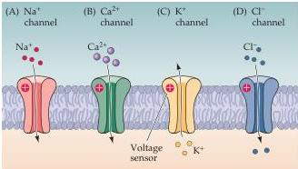
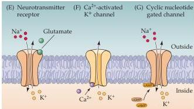

Chapter Four

# Voltage-Gated Ion Channels

Voltage-gated ion channels that are selectively permeable to each of the major physiological ions— $\mathrm{Na^{+}}$ ,  $\mathrm{K^{+}}$ ,  $\mathrm{Ca^{2+}}$ , and  $\mathrm{Cl^-}$ —have now been discovered (Figure 4.4 A–D).
Indeed, many different genes have been discovered for each type of voltage-gated ion channel.
An example is the identification of 10 human  $\mathrm{Na^{+}}$  channel genes.
This finding was unexpected because  $\mathrm{Na^{+}}$  channels from many different cell types have similar functional properties, consistent with their origin from a single gene.
It is now clear, however, that all of these  $\mathrm{Na^{+}}$  channel genes (called SCN genes) produce proteins that differ in their structure, function, and distribution in specific tissues.
For instance, in addition to the rapidly inactivating  $\mathrm{Na^{+}}$  channels discovered by Hodgkin and Huxley in squid axon, a voltage-sensitive  $\mathrm{Na^{+}}$  channel that does not inactivate has been identified in mammalian axons.
As might be expected, this channel gives rise to action potentials of long duration and is a target of local anesthetics such as benzocaine and lidocaine.

Other electrical responses in neurons entail the activation of voltage-gated  $\mathrm{Ca^{2+}}$  channels (Figure 4.4B).
In some neurons, voltage-gated  $\mathrm{Ca^{2+}}$  channels give rise to action potentials in much the same way as voltage-sensitive  $\mathrm{Na^{+}}$  channels.
In other neurons,  $\mathrm{Ca^{2+}}$  channels control the shape of action potentials generated primarily by  $\mathrm{Na^{+}}$  conductance changes.
More generally, by affecting intracellular  $\mathrm{Ca^{2+}}$  concentrations, the activity of  $\mathrm{Ca^{2+}}$  channels regulates an enormous range of biochemical processes within cells (see Chapter 7).
Perhaps the most important of the processes regulated by voltage-sensitive  $\mathrm{Ca^{2+}}$  channels is the release of neurotransmitters at synapses (see Chapter 5).
Given these crucial functions, it is perhaps not surprising that 16 different  $\mathrm{Ca^{2+}}$  channel genes (called CACNA genes) have been identified.
Like  $\mathrm{Na^{+}}$  channels,  $\mathrm{Ca^{2+}}$  channels differ in their activation and inactivation properties, allowing subtle variations in both electrical and chemical signaling processes mediated by  $\mathrm{Ca^{2+}}$ .
As a result, drugs that block voltage-gated  $\mathrm{Ca^{2+}}$  channels are especially valuable in treating a variety of conditions ranging from heart disease to anxiety disorders.

By far the largest and most diverse class of voltage-gated ion channels are the  $\mathrm{K}^+$  channels (Figure 4.4C).
Nearly  $100\mathrm{K}^+$  channel genes are now known, and these fall into several distinct groups that differ substantially in their activation, gating, and inactivation properties.
Some take minutes to inactivate, as in the case of squid axon  $\mathrm{K}^+$  channels studied by Hodgkin and Huxley (Figure 4.5A).
Others inactivate within milliseconds, as is typical of most voltage-gated  $\mathrm{Na}^+$  channels (Figure 4.5B).
These properties influence the

VOLTAGE-GATED CHANNELS

LIGAND-GATED CHANNELS