Channels and Transporters

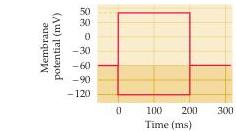

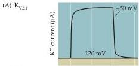

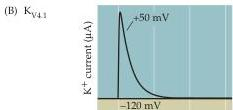

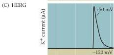

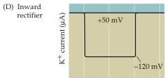

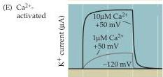

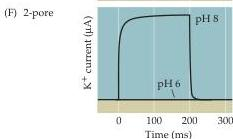

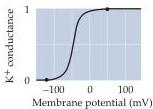
Figure 4.5 Diverse properties of  $\mathbf{K}^{+}$  channels.
Different types of  $\mathbf{K}^{+}$  channels were expressed in Xenopus oocytes (see Box B), and the voltage clamp method was used to change the membrane potential (top) and measure the resulting currents flowing through each type of channel.
These  $\mathbf{K}^{+}$  channels vary markedly in their gating properties, as evident in their currents (left) and conductances (right).
(A)  $\mathrm{K}_{\mathrm{V2.1}}$  channels show little inactivation and are closely related to the delayed rectifier  $\mathbf{K}^{+}$  channels involved in action potential repolarization.
(B)  $\mathrm{K}_{\mathrm{V4.1}}$  channels inactivate during a depolarization.
(C) HERG channels inactivate so rapidly that current flows only when inactivation is rapidly removed at the end of a depolarization.
(D) Inward rectifying  $\mathbf{K}^{+}$  channels allow more  $\mathbf{K}^{+}$  current to flow at hyperpolarized potentials than at depolarized potentials.
(E)  $\mathrm{Ca^{2+}}$ -activated  $\mathbf{K}^{+}$  channels open in response to intracellular  $\mathrm{Ca^{2+}}$  ions and, in some cases, membrane depolarization.
(F)  $\mathbf{K}^{+}$  channels with two pores usually respond to chemical signals, such as pH, rather than changes in membrane potential.

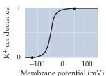

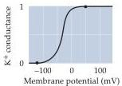

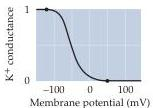

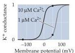

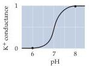