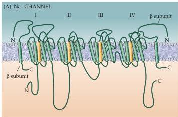
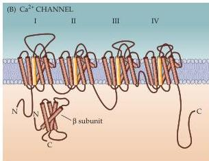
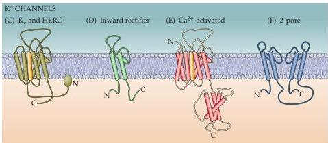
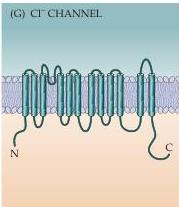

Channels and Transporters 79

In summary, this tremendous variety of ion channels allows neurons to generate electrical signals in response to changes in membrane potential, synaptic input, intracellular second messengers, light, odors, heat, sound, touch, and many other stimuli.

## The Molecular Structure of Ion Channels

Understanding the physical structure of ion channels is obviously the key to sorting out how they actually work.
Until recently, most information about channel structure was derived indirectly from studies of the amino acid composition and physiological properties of these proteins.
For example, a great deal has been learned by exploring the functions of particular amino acids within the proteins using mutagenesis and the expression of such channels in Xenopus oocytes (see Box B).
Such studies have discovered a general transmembrane architecture common to all the major ion channel families.
Thus, these molecules are all integral membrane proteins that span the plasma membrane repeatedly.
$\mathrm{Na^{+}}$ (and $\mathrm{Ca^{2+}}$) channel proteins, consist of repeating motifs of 6 membrane-spanning regions that are repeated 4 times, for a total of 24 transmembrane regions (Figure 4.6A,B).
$\mathrm{Na^{+}}$ (or $\mathrm{Ca^{2+}}$) channels can be produced by just one of these proteins, although other accessory proteins, called $\beta$ subunits, can regulate the function of these channels.
$\mathrm{K^{+}}$ channel proteins typically span the membrane six times (Figure 4.6C),

Figure 4.6 Topology of the principal subunits of voltage-gated $\mathrm{Na^{+}}$, $\mathrm{Ca^{2+}}$, $\mathrm{K^{+}}$, and $\mathrm{Cl^-}$ channels.
Repeating motifs of $\mathrm{Na^{+}}$ (A) and $\mathrm{Ca^{2+}}$ (B) channels are labeled I, II, III, and IV; (C-F) $\mathrm{K^{+}}$ channels are more diverse.
In all cases, four subunits combine to form a functional channel.
(G) Chloride channels are structurally distinct from all other voltage-gated channels.

