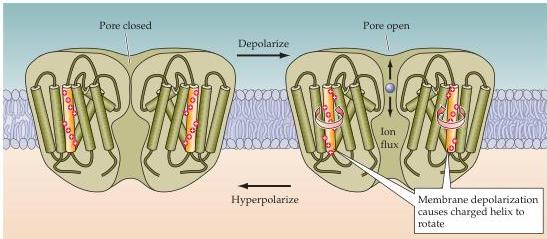

Chapter Four

Figure 4.7 A charged voltage sensor permits voltage-dependent gating of ion channels.
The process of voltage activation may involve the rotation of a positively charged transmembrane domain.
This movement causes a change in the conformation of the pore loop, enabling the channel to conduct specific ions.

though there are some  $\mathrm{K}^+$  channels, such as a bacterial channel and some mammalian channels, that span the membrane only twice (Figure 4.6D), and others that span the membrane four times (Figure 4.6F) or seven times (Figure 4.6E).
Each of these  $\mathrm{K}^+$  channel proteins serves as a channel subunit, with 4 of these subunits typically aggregating to form a single functional ion channel.

Other imaginative mutagenesis experiments have provided information about how these proteins function.
Two membrane-spanning domains of all ion channels appear to form a central pore through which ions can diffuse, and one of these domains contains a protein loop that confers an ability to selectivity allow certain ions to diffuse through the channel pore (Figure 4.7).
As might be expected, the amino acid composition of the pore loop differs among channels that conduct different ions.
These distinct structural features of channel proteins also provide unique binding sites for drugs and for various neurotoxins known to block specific subclasses of ion channels (Box C).
Furthermore, many voltage gated ion channels contain a distinct type of transmembrane helix containing a number of positively charged amino acids along one face of the helix (Figures 4.6 and 4.7).
This structure evidently serves as a sensor that detects changes in the electrical potential across the membrane.
Membrane depolarization influences the charged amino acids such that the helix undergoes a conformational change, which in turn allows the channel pore to open.
One suggestion is that the helix rotates to cause the pore to open (Figure 4.7).
Other types of mutagenesis experiments have demonstrated that one end of certain  $\mathrm{K}^+$  channels plays a key role in channel inactivation.
This intracellular structure (labeled "N" in Figure 4.6C) can plug the channel pore during prolonged depolarization.

More recently, very direct information about the structural underpinnings of ion channel function has come from X-ray crystallography studies of bacterial  $\mathrm{K}^+$  channels (Figure 4.8).
This molecule was chosen for analysis because the large quantity of channel protein needed for crystallography could be obtained by growing large numbers of bacteria expressing this molecule.
The results of such studies showed that the channel is formed by subunits that each cross the plasma membrane twice; between these two membrane-spanning structures is a loop that inserts into the plasma membrane (Figure 4.8A).
Four of these subunits are assembled together to form a chan