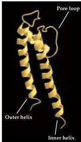
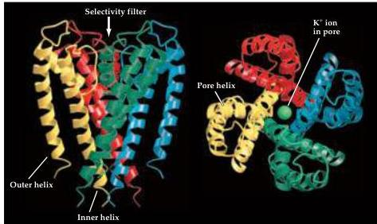
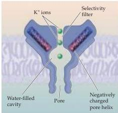

Channels and Transporters

(A)

(B)
SIDE VIEW
TOP VIEW

(C)
Figure 4.8 Structure of a simple bacterial  $\mathbf{K}^{+}$  channel determined by crystallography.
(A) Structure of one subunit of the channel, which consists of two membrane-spanning domains and a pore loop that inserts into the membrane.
(B) Three-dimensional arrangement of four subunits (each in a different color) to form a  $\mathbf{K}^{+}$  channel.
The top view illustrates a  $\mathbf{K}^{+}$  ion (green) within the channel pore.
(C) The permeation pathway of the  $\mathbf{K}^{+}$  channel consists of a large aqueous cavity connected to a narrow selectivity filter.
Helical domains of the channel point negative charges (red) toward this cavity, allowing  $\mathbf{K}^{+}$  ions (green) to become dehydrated and then move through the selectivity filter.
(A, B from Doyle et al., 1998; C after Doyle et al., 1998.)

nel (Figure 4.8B).
In the center of the assembled channel is a narrow opening through the protein that allows  $\mathbf{K}^{+}$  to flow across the membrane.
This opening is the channel pore and is formed by the protein loop, as well as by the membrane-spanning domains.
The structure of the pore is well suited for conducting  $\mathbf{K}^{+}$  ions (Figure 4.8C).
The narrowest part is near the outside mouth of the channel and is so constricted that only a non-hydrated  $\mathbf{K}^{+}$  ion can fit through the bottleneck.
Larger cations, such as  $\mathrm{Cs^{+}}$ , cannot traverse this region of the pore, and smaller cations such as  $\mathrm{Na^{+}}$  cannot enter the pore because the "walls" of the pore are too far apart to stabilize a dehydrated  $\mathrm{Na^{+}}$  ion.
This part of the channel complex is responsible for the selective permeability to  $\mathbf{K}^{+}$  and is therefore called the selectivity filter.
The sequence of amino acids making up part of this selectivity filter is often referred to as the  $\mathbf{K}^{+}$  channel "signature sequence".
Deeper within the channel is a water-filled cavity that connects to the interior of the cell.
This cavity evidently collects  $\mathbf{K}^{+}$  from the cytoplasm and, utilizing negative charges from the protein,