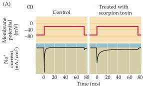
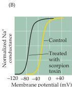
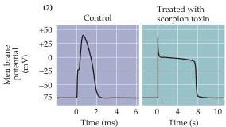

Chapter Four

# Box C

## Toxins That Poison Ion Channels

Given the importance of $\mathrm{Na^{+}}$ and $\mathrm{K^{+}}$ channels for neuronal excitation, it is not surprising that a number of organisms have evolved channel-specific toxins as mechanisms for self-defense or for capturing prey.
A rich collection of natural toxins selectively target the ion channels of neurons and other cells.
These toxins are valuable not only for survival, but for studying the function of cellular ion channels.
The best-known channel toxin is tetrodotoxin, which is produced by certain puffer fish and other animals.
Tetrodotoxin produces a potent and specific obstruction of the $\mathrm{Na^{+}}$ channels responsible for action potential generation, thereby paralyzing the animals unfortunate enough to ingest it.
Saxitoxin, a chemical homologue of tetrodotoxin produced by dinoflagellates, has a similar action on $\mathrm{Na^{+}}$ channels.
The potentially lethal effects of eating shellfish that have ingested these "red tide" dinoflagellates are due to the potent neuronal actions of saxitoxin.

Scorpions paralyze their prey by injecting a potent mix of peptide toxins that also affect ion channels.
Among these are the $\alpha$-toxins, which slow the inactivation of $\mathrm{Na^{+}}$ channels (Figure A1); exposure of neurons to these toxins prolongs the action potential (Figure A2),

(A) Effects of toxin treatment on frog axons.
(1) $\alpha$-Toxin from the scorpion Leiurus quinquestriatus prolongs $\mathrm{Na^{+}}$ currents recorded with the voltage clamp method.
(2) As a result of the increased $\mathrm{Na^{+}}$ current, $\alpha$-toxin greatly prolongs the duration of the axonal action potential.
Note the change in timescale after treating with toxin.
(B) Treatment of a frog axon with $\beta$-toxin from another scorpion, Centruroides sculpturatus, shifts the activation of $\mathrm{Na^{+}}$ channels, so that $\mathrm{Na^{+}}$ conductance begins to increase at potentials much more negative than usual.
(A after Schmidt and Schmidt, 1972; B after Cahalan, 1975.)

thereby scrambling information flow within the nervous system of the soon-to-be-devoured victim.
Other peptides in scorpion venom, called $\beta$-toxins, shift the voltage dependence of $\mathrm{Na^{+}}$ channel activation (Figure B).
These toxins cause $\mathrm{Na^{+}}$ channels to open at potentials much more negative than normal, disrupting action potential generation.
Some alkaloid toxins combine these actions, both removing inactivation and shifting activation of $\mathrm{Na^{+}}$ channels.
One such toxin is batrachotoxin, produced by a species of frog; some tribes of South American Indians use this poison on their arrow tips.
A number of plants produce similar toxins, including aconitine, from buttercups; veratridine, from lilies; and a number of insecticidal toxins produced by plants such as chrysanthemums and rhododendrons.

Potassium channels have also been targeted by toxin-producing organisms.

Peptide toxins affecting $\mathrm{K^{+}}$ channels include dendrotoxin, from wasps; apamin, from bees; and charybdotoxin, yet another toxin produced by scorpions.
All of these toxins block $\mathrm{K^{+}}$ channels as their primary action; no toxin is known to affect the activation or inactivation of these channels, although such agents may simply be awaiting discovery.

## References

CAHALAN, M.
(1975) Modification of sodium channel gating in frog myelinated nerve fibers by Centruroides sculpturatus scorpion venom.
J.
Physiol.
(Lond.) 244: 511-534.
NARAHASHI, T.
(2000) Neuroreceptors and ion channels as the basis for drug action: Present and future.
J.
Pharmacol.
Exptl.
Therapeutics 294: 1-26.
SCHMIDT, O.
AND H.
SCHMIDT (1972) Influence of calcium ions on the ionic currents of nodes of Ranvier treated with scorpion venom.
Pflügers Arch.
333: 51-61.

