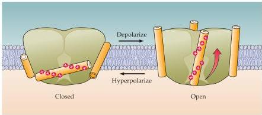
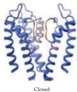
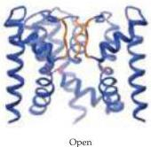

Channels and Transporters 83

allows K⁺ ions to become dehydrated so they can enter the selectivity filter.
These "naked" ions are then able to move through four K⁺ binding sites within the selectivity filter to eventually reach the extracellular space (recall that the normal concentration gradient drives K⁺ out of cells).
On average, two K⁺ ions reside within the selectivity filter at any moment, with electrostatic repulsion between the two ions helping to speed their transit through the selectivity filter, thereby permitting rapid ion flux through the channel.

Crystallographic studies have also determined the structure of the voltage sensor in another type of bacterial K⁺ channel.
Such studies indicate that the sensor is at the interface between proteins and lipid on the cytoplasmic surface of the channel, leading to the suggestion that the sensor is a paddle-like structure that moves through the membrane to gate the opening of the channel pore (Figure 4.9A), rather than being a rotating helix buried within the ion channel protein (as in Figure 4.7).
Crystallographic work has also revealed the molecular basis of the rapid transitions between the closed and the open state of the channel during channel gating.
By comparing data from K⁺ channels crystallized in what is believed to be closed and open conformations (Figure 4.9B), it appears that channels gate by a conformational change in one of the transmembrane helices lining the channel pore.
Producing a "kink" in one of these helices increases the opening from the central water-filled pore to the intracellular space, thereby permitting ion fluxes.

(A)

(B)

Figure 4.9 Structural features of K⁺ channel gating.
(A) Voltage sensing may involve paddle-like structures of the channel.
These paddles reside within the lipid bilayer of the plasma membrane and may respond to changes in membrane potential by moving through the membrane.
The gating charges that sense membrane potential are indicated by red "plus" signs.
(B) Structure of K⁺ channels in closed (left) and open (right) conformations.
Three of the four channel subunits are shown.
Opening of the pore of the channel involves kinking of a transmembrane domain at the point indicated in red, which then dilates the pore.
(A after Jiang et al., 2003; B after MacKinnon, 2003).