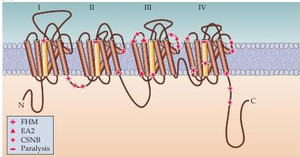
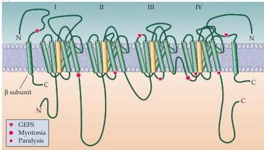
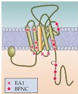
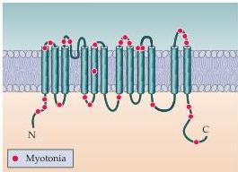

Chapter Four

# Box D

## Diseases Caused by Altered Ion Channels

Several genetic diseases, collectively called *channelopathies*, result from small but critical alterations in ion channel genes.
The best-characterized of these diseases are those that affect skeletal muscle cells.
In these disorders, alterations in ion channel proteins produce either myotonia (muscle stiffness due to excessive electrical excitability) or paralysis (due to insufficient muscle excitability).
Other disorders arise from ion channel defects in heart, kidney, and the inner ear.

Channelopathies associated with ion channels localized in brain are much more difficult to study.
Nonetheless, voltage-gated $\mathrm{Ca^{2+}}$ channels have recently been implicated in a range of neurological diseases.
These include episodic ataxia, spinocerebellar degeneration, night blindness, and migraine headaches.
*Familial hemiplegic migraine* (FHM) is characterized by migraine attacks that typically last one to three days.
During such episodes, patients experience severe headaches and vomiting.
Several mutations in a human $\mathrm{Ca^{2+}}$ channel have been identified in families with FHM, each having different clinical symptoms.
For example, a mutation in the pore-forming region of the channel produces hemiplegic migraine with progressive cerebellar ataxia, whereas other mutations cause only the usual FHM symptoms.
How these altered $\mathrm{Ca^{2+}}$ channel properties lead to migraine attacks is not known.

*Episodic ataxia type 2* (EA2) is a neurological disorder in which affected individuals suffer recurrent attacks of abnormal limb movements and severe ataxia.
These problems are sometimes accompanied by

Genetic mutations in (A) $\mathrm{Ca^{2+}}$ channels, (B) $\mathrm{Na^{+}}$ channels, (C) $\mathrm{K^{+}}$ channels, and (D) $\mathrm{Cl^-}$ channels that result in diseases.
Red regions indicate the sites of these mutations; the red circles indicate mutations.
(After Lehmann-Horn and Jurkat-Kott, 1999.)

(A) $\mathrm{Ca^{2+}}$ CHANNEL

(B) $\mathrm{Na^{+}}$ CHANNEL

(C) $\mathrm{K^{+}}$ CHANNEL

(D) $\mathrm{Cl^-}$ CHANNEL