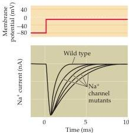

Channels and Transporters 85

Mutations in Na⁺ channels slow the rate of inactivation of Na⁺ currents.
(After Barchi, 1995.)

nied by vertigo, nausea, and headache.
Usually, attacks are precipitated by emotional stress, exercise, or alcohol and last for a few hours.
The mutations in EA2 cause Ca²⁺ channels to be truncated at various sites, which may cause the clinical manifestations of the disease by preventing the normal assembly of Ca²⁺ channels in the membrane.

X-linked congenital stationary night blindness (CSNB) is a recessive retinal disorder that causes night blindness, decreased visual acuity, myopia, nystagmus, and strabismus.
Complete CSNB causes retinal rod photoreceptors to be nonfunctional.
Incomplete CSNB causes subnormal (but measurable) functioning

of both rod and cone photoreceptors.
Like EA2, the incomplete type of CSNB is caused by mutations producing truncated Ca²⁺ channels.
Abnormal retinal function may arise from decreased Ca²⁺ currents and neurotransmitter release from photoreceptors (see Chapter 11).

A defect in brain Na⁺ channels causes generalized epilepsy with febrile seizures (GEFS) that begins in infancy and usually continues through early puberty.
This defect has been mapped to two mutations: one on chromosome 2 that encodes an α subunit for a voltage-gated Na⁺ channel, and the other on chromosome 19 that encodes a Na⁺ channel β subunit.
These mutations cause a slowing of Na⁺ channel inactivation (see figure above), which may explain the neuronal hyperexcitability underlying GEFS.

Another type of seizure, benign familial neonatal convulsion (BFNC), is due to K⁺ channel mutations.
This disease is characterized by frequent brief seizures commencing within the first week of life and disappearing spontaneously within a few months.
The mutation has been mapped to at least two voltage-gated K⁺ channel genes.
A reduction in K⁺ current flow through the mutated channels probably accounts for the hyperexcitability associated with this defect.
A related disease, episodic ataxia type 1 (EA1), has been linked to a defect in another type of voltage-gated K⁺ channel.
EA1 is characterized by brief episodes of ataxia.
Mu

tant channels inhibit the function of other, non-mutant K⁺ channels and may produce clinical symptoms by impairing action potential repolarization.
Mutations in the K⁺ channels of cardiac muscle are responsible for the irregular heartbeat of patients with long Q-T syndrome.
Numerous genetic disorders affect the voltage-gated channels of skeletal muscle and are responsible for a host of muscle diseases that either cause muscle weakness (paralysis) or muscle contraction (myotonia).

# References

BARCHI, R.
L.
(1995) Molecular pathology of the skeletal muscle sodium channel.
Ann.
Rev.
Physiol.
57: 355-385.
BERKOVIC, S.
F.
AND I.
E.
SCHEFFER (1997) Epilepsies with single gene inheritance.
Brain Develop.
19:13-28.
COOPER, E.
C.
AND L.
Y.
JAN (1999) Ion channel genes and human neurological disease: Recent progress, prospects, and challenges.
Proc.
Natl.
Acad.
Sci.
USA 96: 4759-4766.
DAVIES, N.
P.
AND M.
G.
HANNA (1999) Neurological channelopathies: Diagnosis and therapy in the new millennium.
Ann.
Med.
31: 406-420.
JEN, J.
(1999) Calcium channelopathies in the central nervous system.
Curr.
Op.
Neurobiol.
9:274-280.
LEHMANN-HORN, F.
AND K.
JURKAT-ROTT (1999) Voltage-gated ion channels and hereditary disease.
Physiol.
Rev.
79: 1317-1372.
OPHOFF, R.
A., G.
M.
TERWINDT, R.
R.
FRANTS AND M.
D.
FERRARI (1998) P/Q-type Ca²⁺ channel defects in migraine, ataxia and epilepsy.
Trends Pharm.
Sci.
19: 121-127.

In short, ion channels are integral membrane proteins with characteristic features that allow them to assemble into multimolecular aggregates.
Collectively, these structures allow channels to conduct ions, sense the transmembrane potential, to inactivate, and to bind to various neurotoxins.
A combination of physiological, molecular biological and crystallographic studies has begun to provide a detailed physical picture of K⁺ channels.
This work has now provided considerable insight into how ions are conducted from one side of the plasma membrane to the other, how a channel can be selectively permeable to a single type of ion, how they are able to sense changes in membrane voltage, and how they gate the opening of their pores.
It is likely that other types of ion channels will be similar in their functional architecture.
Finally, this sort of work has illuminated how mutations in ion channel genes can lead to a variety of neurological disorders (Box D).