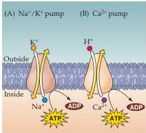
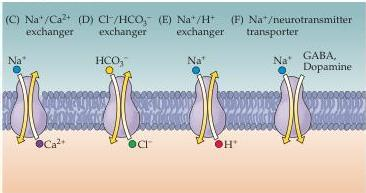

Chapter Four

# Active Transporters Create and Maintain Ion Gradients

Up to this point, the discussion of the molecular basis of electrical signaling has taken for granted the fact that nerve cells maintain ion concentration gradients across their surface membranes.
However, none of the ions of physiological importance (Na⁺, K⁺, Cl⁻, and Ca²⁺) are in electrochemical equilibrium.
Because channels produce electrical effects by allowing one or more of these ions to diffuse down their electrochemical gradients, there would be a gradual dissipation of these concentration gradients unless nerve cells could restore ions displaced during the current flow that occurs as a result of both neural signaling and the continual ionic leakage that occurs at rest.
The work of generating and maintaining ionic concentration gradients for particular ions is carried out by a group of plasma membrane proteins known as active transporters.

Active transporters carry out this task by forming complexes with the ions that they are translocating.
The process of ion binding and unbinding for transport typically requires several milliseconds.
As a result, ion translocation by active transporters is much slower than ion movement through channels: Recall that ion channels can conduct thousands of ions across a membrane each millisecond.
In short, active transporters gradually store energy in the form of ion concentration gradients, whereas the opening of ion channels rapidly dissipates this stored energy during relatively brief electrical signaling events.

Several types of active transporter have now been identified (Figure 4.10).
Although the specific jobs of these transporters differ, all must translocate ions against their electrochemical gradients.
Moving ions uphill requires the consumption of energy, and neuronal transporters fall into two classes based on their energy sources.
Some transporters acquire energy directly from the hydrolysis of ATP and are called ATPase pumps (Figure 4.10, left).
The most prominent example of an ATPase pump is the Na⁺ pump (or, more properly, the Na⁺/K⁺ ATPase pump), which is responsible for maintaining transmembrane concentration gradients for both Na⁺ and K⁺ (Figure 4.10A).
Another is the Ca²⁺ pump, which provides one of the main mechanisms for removing Ca²⁺ from cells (Figure 4.10B).
The second class of active transporter does not use ATP directly, but depends instead on the electrochemical gradients of other ions as an energy source.
This type of transporter carries one or more ions up its electrochemical gradient while simultaneously taking another ion (most often Na⁺) down its gradient.
Because at least two species of ions are

Figure 4.10 Examples of ion transporters found in cell membranes.
(A,B) Some transporters are powered by the hydrolysis of ATP (ATPase pumps), whereas others (C-F) use the electrochemical gradients of co-transported ions as a source of energy (ion exchangers).

ION EXCHANGERS