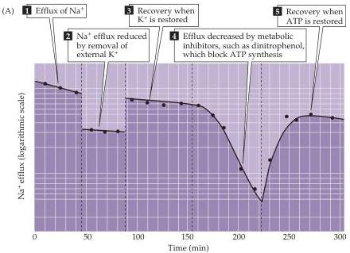
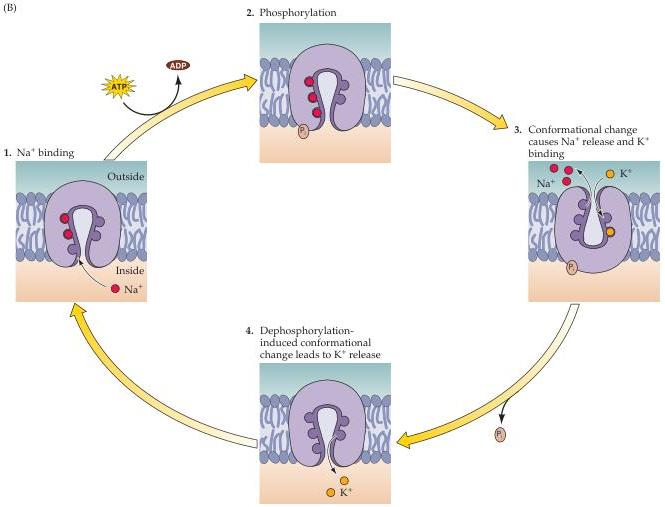

Chapter Four

Figure 4.11 Ionic movements due to the  $\mathrm{Na^{+} / K^{+}}$  pump.
(A) Measurement of radioactive  $\mathrm{Na^{+}}$  efflux from a squid giant axon.
This efflux depends on external  $\mathbf{K}^+$  and intracellular ATP.
(B) A model for the movement of ions by the  $\mathrm{Na^{+} / K^{+}}$  pump.
Uphill movements of  $\mathrm{Na^{+}}$  and  $\mathbf{K}^+$  are driven by ATP, which phosphorylates the pump.
These fluxes are asymmetrical, with three  $\mathrm{Na^{+}}$  carried out for every two  $\mathbf{K}^+$  brought in.
(A after Hodgkin and Keynes, 1955; B after Lingrel et al., 1994.)

