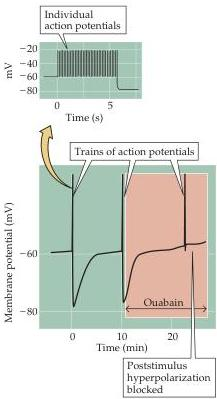
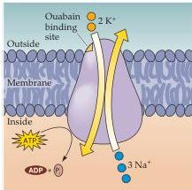
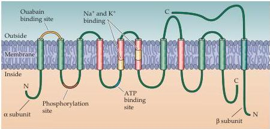

Channels and Transporters

Figure 4.12 The electrogenic transport of ions by the $\mathrm{Na^{+} / K^{+}}$ pump can influence membrane potential.
Measurements of the membrane potential of a small unmyelinated axon show that a train of action potentials is followed by a long-lasting hyperpolarization.
This hyperpolarization is blocked by ouabain, indicating that it results from the activity of the $\mathrm{Na^{+} / K^{+}}$ pump.
(After Rang and Ritchie, 1968.)

small unmyelinated axons produces a substantial hyperpolarization (Figure 4.12).
During the period of stimulation, $\mathrm{Na^{+}}$ enters through voltage-gated channels and accumulates within the axons.
As the pump removes this extra $\mathrm{Na^{+}}$, the resulting current generates a long-lasting hyperpolarization.
Support for this interpretation comes from the observation that conditions that block the $\mathrm{Na^{+} / K^{+}}$ pump—for example, treatment with ouabain, a plant glycoside that specifically inhibits the pump—prevent the hyperpolarization.
The electrical contribution of the $\mathrm{Na^{+} / K^{+}}$ pump is particularly significant in these small-diameter axons because their large surface-to-volume ratio causes intracellular $\mathrm{Na^{+}}$ concentration to rise to higher levels than it would in other cells.
Nonetheless, it is important to emphasize that, in most circumstances, the $\mathrm{Na^{+} / K^{+}}$ pump plays no part in generating the action potential and has very little direct effect on the resting potential.

## The Molecular Structure of the $\mathrm{Na^{+} / K^{+}}$ Pump

These observations imply that the $\mathrm{Na^{+}}$ and $\mathrm{K^{+}}$ pump must exhibit several molecular properties: (1) It must bind both $\mathrm{Na^{+}}$ and $\mathrm{K^{+}}$; (2) it must possess sites that bind ATP and receive a phosphate group from this ATP; and (3) it must bind ouabain, the toxin that blocks this pump (Figure 4.13A).
A variety of studies have now identified the aspects of the protein that account for these properties of the $\mathrm{Na^{+} / K^{+}}$ pump.
This pump is a large, integral membrane protein made up of at least two subunits, called $\alpha$ and $\beta$.
The primary sequence shows that the $\alpha$ subunit spans the membrane 10 times, with most of the molecule found on the cytoplasmic side, whereas the $\beta$ subunit spans the membrane once and is predominantly extracellular.
Although a detailed account of the functional domains of the $\mathrm{Na^{+} / K^{+}}$ pump is not yet available, some parts of the amino acid sequence have identified functions (Figure 4.13B).
One intracellular domain of the protein is required for ATP binding

(A)

(B)