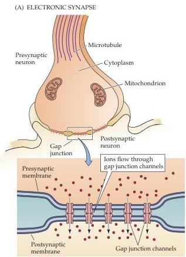
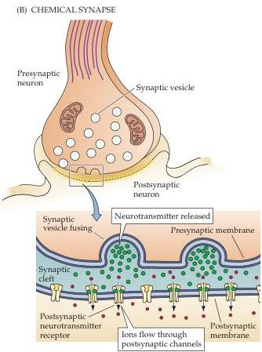

Chapter Five

Figure 5.1 Electrical and chemical synapses differ fundamentally in their transmission mechanisms.
(A) At electrical synapses, gap junctions between pre- and postsynaptic membranes permit current to flow passively through intercellular channels (blowup).
This current flow changes the postsynaptic membrane potential, initiating (or in some instances inhibiting) the generation of postsynaptic action potentials.
(B) At chemical synapses, there is no intercellular continuity, and thus no direct flow of current from pre- to postsynaptic cell.
Synaptic current flows across the postsynaptic membrane only in response to the secretion of neurotransmitters, which open or close postsynaptic ion channels after binding to receptor molecules (blowup).

The structure of an electrical synapse is shown schematically in Figure 5.1A.
The "upstream" neuron, which is the source of current, is called the presynaptic element, and the "downstream" neuron into which this current flows is termed postsynaptic.
The membranes of the two communicating neurons come extremely close at the synapse and are actually linked together by an intercellular specialization called a gap junction.
Gap junctions contain precisely aligned, paired channels in the membrane of the pre- and postsynaptic neurons, such that each channel pair forms a pore (see Figure 5.2A).
The pore of a gap junction channel is much larger than the pores of the voltage-gated ion channels described in the previous chapter.
As a result, a variety of substances can simply diffuse between the cytoplasm of the pre- and postsynaptic neurons.
In addition to ions, substances that diffuse through gap junction pores include molecules with molecular weights as great as several hundred daltons.
This permits ATP and other important intracellular metabolites, such as second messengers (see Chapter 7), to be transferred between neurons.

Electrical synapses thus work by allowing ionic current to flow passively through the gap junction pores from one neuron to another.
The usual source of this current is the potential difference generated locally by the action potential (see Chapter 3).
This arrangement has a number of interesting consequences.
One is that transmission can be bidirectional; that is, current can flow in either direction across the gap junction, depending on which member of the coupled pair is invaded by an action potential (although