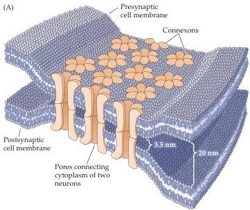
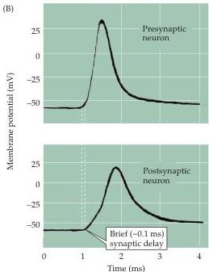

Synaptic Transmission

some types of gap junctions have special features that render their transmission unidirectional).
Another important feature of the electrical synapse is that transmission is extraordinarily fast: because passive current flow across the gap junction is virtually instantaneous, communication can occur without the delay that is characteristic of chemical synapses.

These features are apparent in the operation of the first electrical synapse to be discovered, which resides in the crayfish nervous system.
A postsynaptic electrical signal is observed at this synapse within a fraction of a millisecond after the generation of a presynaptic action potential (Figure 5.2).
In fact, at least part of this brief synaptic delay is caused by propagation of the action potential into the presynaptic terminal, so that there may be essentially no delay at all in the transmission of electrical signals across the synapse.
Such synapses interconnect many of the neurons within the circuit that allows the crayfish to escape from its predators, thus minimizing the time between the presence of a threatening stimulus and a potentially life-saving motor response.

A more general purpose of electrical synapses is to synchronize electrical activity among populations of neurons.
For example, the brainstem neurons that generate rhythmic electrical activity underlying breathing are synchronized by electrical synapses, as are populations of interneurons in the cerebral cortex, thalamus, cerebellum, and other brain regions.
Electrical transmission between certain hormone-secreting neurons within the mammalian hypothalamus ensures that all cells fire action potentials at about the same time, thus facilitating a burst of hormone secretion into the circulation.
The fact that gap junction pores are large enough to allow molecules such as ATP and second messengers to diffuse intercellularly also permits electrical synapses to coordinate the intracellular signaling and metabolism of coupled cells.
This property may be particularly important for glial cells, which form large intracellular signaling networks via their gap junctions.

Figure 5.2 Structure and function of gap junctions at electrical synapses.
(A) Gap junctions consist of hexameric complexes formed by the coming together of subunits called connexons, which are present in both the pre- and postsynaptic membranes.
The pores of the channels connect to one another, creating electrical continuity between the two cells.
(B) Rapid transmission of signals at an electrical synapse in the crayfish.
An action potential in the presynaptic neuron causes the postsynaptic neuron to be depolarized within a fraction of a millisecond.
(B after Furshpan and Potter, 1959.)

