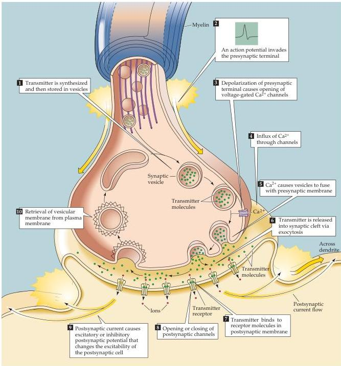

Synaptic Transmission

Figure 5.3 Sequence of events involved in transmission at a typical chemical synapse.

ety of postsynaptic targets in the central and peripheral nervous systems, preeminently at the neuromuscular junction of striated muscles and in the visceral motor system (see Chapters 6 and 20).

Over the years, a number of formal criteria have emerged that definitively identify a substance as a neurotransmitter (Box A).
These have led to the identification of more than 100 different neurotransmitters, which can be