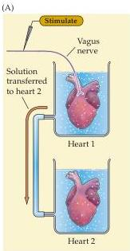
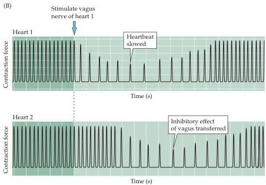

Chapter Five

Figure 5.4 Loewi's experiment demonstrating chemical neurotransmission.
(A) Diagram of experimental setup.
(B) Where the vagus nerve of an isolated frog's heart was stimulated, the heart rate decreased (upper panel).
If the perfusion fluid from the stimulated heart was transferred to a second heart, its rate decreased as well (lower panel).

classified into two broad categories: small-molecule neurotransmitters and neuropeptides (Chapter 6).
Having more than one transmitter diversifies the physiological repertoire of synapses.
Multiple neurotransmitters can produce different types of responses on individual postsynaptic cells.
For example, a neuron can be excited by one type of neurotransmitter and inhibited by another type of neurotransmitter.
The speed of postsynaptic responses produced by different transmitters also differs, allowing control of electrical signaling over different time scales.
In general, small-molecule neurotransmitters mediate rapid synaptic actions, whereas neuropeptides tend to modulate slower, ongoing synaptic functions.

Until relatively recently, it was believed that a given neuron produced only a single type of neurotransmitter.
It is now clear, however, that many types of neurons synthesize and release two or more different neurotransmitters.
When more than one transmitter is present within a nerve terminal, the molecules are called co-transmitters.
Because different types of transmitters can be packaged in different populations of synaptic vesicles, co-transmitters need not be released simultaneously.
When peptide and small-molecule neurotransmitters act as co-transmitters at the same synapse, they are differentially released according to the pattern of synaptic activity: low-frequency activity often releases only small neurotransmitters, whereas high-frequency activity is required to release neuropeptides from the same presynaptic terminals.
As a result, the chemical signaling properties of such synapses change according to the rate of activity.

Effective synaptic transmission requires close control of the concentration of neurotransmitters within the synaptic cleft.
Neurons have therefore developed a sophisticated ability to regulate the synthesis, packaging, release, and