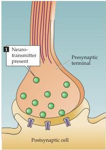
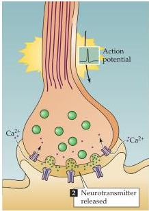
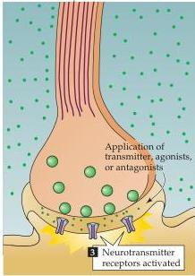

Synaptic Transmission

# Box A

# Criteria That Define a Neurotransmitter

Three primary criteria have been used to confirm that a molecule acts as a neurotransmitter at a given chemical synapse.

1.
The substance must be present within the presynaptic neuron.
Clearly, a chemical cannot be secreted from a presynaptic neuron unless it is present there.
Because elaborate biochemical pathways are required to produce neurotransmitters, showing that the enzymes and precursors required to synthesize the substance are present in presynaptic neurons provides additional evidence that the substance is used as a transmitter.
Note, however, that since the transmitters glutamate, glycine, and aspartate are also needed for protein synthesis and other metabolic reactions in all neurons, their presence is not sufficient evidence to establish them as neurotransmitters.

2.
The substance must be released in response to presynaptic depolarization, and the release must be  $Ca^{2+}$ -dependent.

Another essential criterion for identifying a neurotransmitter is to demonstrate that it is released from the presynaptic neuron in response to presynaptic electrical activity, and that this release requires  $\mathrm{Ca^{2+}}$  influx into the presynaptic terminal.
Meeting this criterion is technically challenging, not only because it may be difficult to selectively stimulate the presynaptic neurons, but also because enzymes and transporters efficiently remove the secreted neurotransmitters.

3.
Specific receptors for the substance must be present on the postsynaptic cell.
A neurotransmitter cannot act on its target unless specific receptors for the transmitter are present in the postsynaptic membrane.
One way to demonstrate receptors is to show that application of exogenous transmitter mimics the post

synaptic effect of presynaptic stimulation.
A more rigorous demonstration is to show that agonists and antagonists that alter the normal postsynaptic response have the same effect when the substance in question is applied exogenously.
High-resolution histological methods can also be used to show that specific receptors are present in the postsynaptic membrane (by detection of radioactively labeled receptor antibodies, for example).

Fulfilling these criteria establishes unambiguously that a substance is used as a transmitter at a given synapse.
Practical difficulties, however, have prevented these standards from being applied at many types of synapses.
It is for this reason that so many substances must be referred to as "putative" neurotransmitters.

Demonstrating the identity of a neurotransmitter at a synapse requires showing (1) its presence, (2) its release, and (3) the postsynaptic presence of specific receptors.

(1)

(2)

(3)