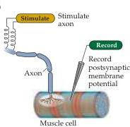
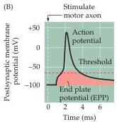
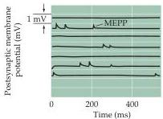
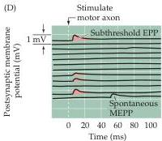

Chapter Five

(A)

(B)

(C)

(D)
Figure 5.6 Synaptic transmission at the neuromuscular junction.
(A) Experimental arrangement, typically using the muscle of a frog or rat.
The axon of the motor neuron innervating the muscle fiber is stimulated with an extracellular electrode, while an intracellular microelectrode is inserted into the postsynaptic muscle cell to record its electrical responses.
(B) End plate potentials (EPPs) evoked by stimulation of a motor neuron are normally above threshold and therefore produce an action potential in the postsynaptic muscle cell.
(C) Spontaneous miniature EPPs (MEPPs) occur in the absence of presynaptic stimulation.
(D) When the neuromuscular junction is bathed in a solution that has a low concentration of  $\mathrm{Ca^{2+}}$ , stimulating the motor neuron evokes EPPs whose amplitudes are reduced to about the size of MEPPs.
(After Fatt and Katz, 1952.)

aptic transmission.
The removal of neurotransmitters involves diffusion away from the postsynaptic receptors, in combination with reuptake into nerve terminals or surrounding glial cells, degradation by specific enzymes, or a combination of these mechanisms.
Specific transporter proteins remove most small-molecule neurotransmitters (or their metabolites) from the synaptic cleft, ultimately delivering them back to the presynaptic terminal for reuse.

## Quantal Release of Neurotransmitters

Much of the evidence leading to the present understanding of chemical synaptic transmission was obtained from experiments examining the release of ACh at neuromuscular junctions.
These synapses between spinal motor neurons and skeletal muscle cells are simple, large, and peripherally located, making them particularly amenable to experimental analysis.
Such synapses occur at specializations called end plates because of the saucer-like appearance of the site on the muscle fiber where the presynaptic axon elaborates its terminals (Figure 5.6A).
Most of the pioneering work on neuromuscular transmission was performed by Bernard Katz and his collaborators at University College London during the 1950s and 1960s, and Katz has been widely recognized for his remarkable contributions to understanding synaptic transmission.
Though he worked primarily on the frog neuromuscular junction, numerous subsequent experiments have confirmed the applicability of his observations to transmission at chemical synapses throughout the nervous system.

When an intracellular microelectrode is used to record the membrane potential of a muscle cell, an action potential in the presynaptic motor neuron can be seen to elicit a transient depolarization of the postsynaptic muscle fiber.
This change in membrane potential, called an end plate potential (EPP), is normally large enough to bring the membrane potential of the muscle cell well above the threshold for producing a postsynaptic action potential (Figure 5.6B).
The postsynaptic action potential triggered by the EPP causes the muscle fiber to contract.
Unlike the case for electrical synapses, there is a pronounced delay between the time that the presynaptic motor neuron is stimulated and when the EPP occurs in the postsynaptic muscle cell.
Such a delay is characteristic of all chemical synapses.

One of Katz's seminal findings, in studies carried out with Paul Fatt in 1951, was that spontaneous changes in muscle cell membrane potential occur even in the absence of stimulation of the presynaptic motor neuron (Figure 5.6C).
These changes have the same shape as EPPs but are much