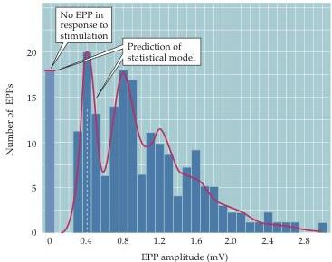
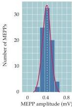

Chapter Five

(A)
Figure 5.7 Quantized distribution of EPP amplitudes evoked in a low  $\mathrm{Ca^{2+}}$  solution.
Peaks of EPP amplitudes (A) tend to occur in integer multiples of the mean amplitude of MEPPs, whose amplitude distribution is shown in (B).
The leftmost bar in the EPP amplitude distribution shows trials in which presynaptic stimulation failed to elicit an EPP in the muscle cell.
The red curve indicates the prediction of a statistical model based on the assumption that the EPPs result from the independent release of multiple MEPP-like quanta.
The observed match, including the predicted number of failures, supports this interpretation.
(After Boyd and Martin, 1955.)

(B)

cles are the repositories of transmitters.
These studies have shown that ACh is highly concentrated in the synaptic vesicles of motor neurons, where it is present at a concentration of about  $100\mathrm{mM}$ .
Given the diameter of a small, clear-core synaptic vesicle ( $\sim 50\mathrm{nm}$ ), approximately 10,000 molecules of neurotransmitter are contained in a single vesicle.
This number corresponds quite nicely to the amount of ACh that must be applied to a neuromuscular junction to mimic a MEPP, providing further support for the idea that quanta arise from discharge of the contents of single synaptic vesicles.

To prove that quanta are caused by the fusion of individual synaptic vesicles with the plasma membrane, it is necessary to show that each fused vesicle causes a single quantal event to be recorded postsynaptically.
This challenge was met in the late 1970s, when John Heuser, Tom Reese, and colleagues correlated measurements of vesicle fusion with the quantal content of EPPs at the neuromuscular junction.
In their experiments, the number of vesicles that fused with the presynaptic plasma membrane was measured by electron microscopy in terminals that had been treated with a drug (4-aminopyridine, or 4-AP) that enhances the number of vesicle fusion events produced by single action potentials (Figure 5.8A).
Parallel electrical measurements were made of the quantal content of the EPPs elicited in this way.
A comparison of the number of synaptic vesicle fusions observed with the electron microscope and the number of quanta released at the synapse showed a good correlation between these two measures (Figure 5.8B).
These results remain one of the strongest lines of support for the idea that a quantum of transmitter release is due to a synaptic vesicle fusing with the presynaptic membrane.
Subsequent evidence, based on other means of measuring vesicle fusion, has left no doubt about the validity of this general interpretation of chemical synaptic transmission.
Very recent work has identified structures within the presynaptic terminal that connect vesicles to the plasma membrane and may be involved in membrane fusion (Figure 5.8C).