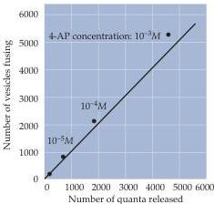
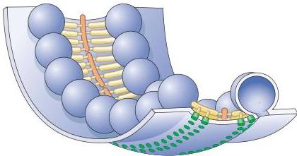

Synaptic Transmission

(A)

(B)

(C)

# Local Recycling of Synaptic Vesicles

The fusion of synaptic vesicles causes new membrane to be added to the plasma membrane of the presynaptic terminal, but the addition is not permanent.
Although a bout of exocytosis can dramatically increase the surface area of presynaptic terminals, this extra membrane is removed within a few minutes.
Heuser and Reese performed another important set of experiments showing that the fused vesicle membrane is actually retrieved and taken back into the cytoplasm of the nerve terminal (a process called endocytosis).
The experiments, again carried out at the frog neuromuscular junction, were based on filling the synaptic cleft with horseradish peroxidase (HRP), an enzyme that can be made to produce a dense reaction product that is visible in an electron microscope.
Under appropriate experimental conditions, endocytosis could then be visualized by the uptake of HRP into the nerve terminal (Figure 5.9).
To activate endocytosis, the presynaptic terminal was stimulated with a train of action potentials, and the subsequent fate of the HRP was followed by electron microscopy.
Immediately follow

Figure 5.8 Relationship of synaptic vesicle exocytosis and quantal transmitter release.
(A) A special electron microscopical technique called freeze-fracture microscopy was used to visualize the fusion of synaptic vesicles in presynaptic terminals of frog motor neurons.
Left: Image of the plasma membrane of an unstimulated presynaptic terminal.
Right: Image of the plasma membrane of a terminal stimulated by an action potential.
Stimulation causes the appearance of dimple-like structures that represent the fusion of synaptic vesicles with the presynaptic membrane.
The view is as if looking down on the release sites from outside the presynaptic terminal.
(B) Comparison of the number of observed vesicle fusions to the number of quanta released by a presynaptic action potential.
Transmitter release was varied by using a drug (4-AP) that affects the duration of the presynaptic action potential, thus changing the amount of calcium that enters during the action potential.
The diagonal line is the 1:1 relationship expected if each vesicle that opened released a single quantum of transmitter.
(C) Fine structure of vesicle fusion sites of frog presynaptic terminals.
Synaptic vesicles are arranged in rows and are connected to each other and to the plasma membrane by a variety of proteinaceous structures (yellow).
Green structures in the presynaptic membrane, corresponding to the rows of particles seen in (A), are thought to be  $\mathrm{Ca^{2+}}$  channels.
(A and B from Heuser et al., 1979; C after Harlow et al., 2001)