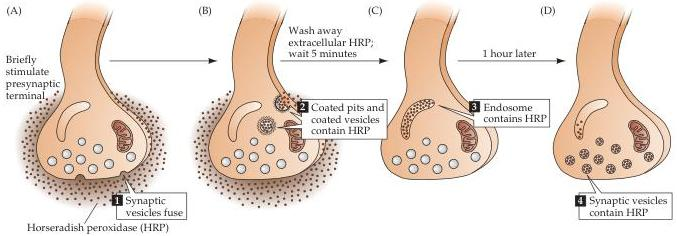
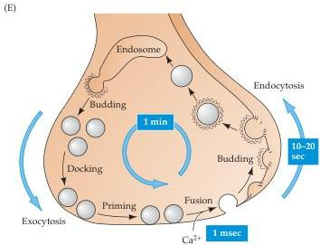

Chapter Five

Figure 5.9 Local recycling of synaptic vesicles in presynaptic terminals.
(A) Horseradish peroxidase (HRP) introduced into the synaptic cleft is used to follow the fate of membrane retrieved from the presynaptic plasma membrane.
Stimulation of endocytosis by presynaptic action potentials causes HRP to be taken up into the presynaptic terminals via a pathway that includes (B) coated vesicles and (C) endosomes.
(D) Eventually, the HRP is found in newly formed synaptic vesicles.
(E) Interpretation of the results shown in A-D.
Calcium-regulated fusion of vesicles with the presynaptic membrane is followed by endocytotic retrieval of vesicular membrane via coated vesicles and endosomes, and subsequent re-formation of new synaptic vesicles.
(After Heuser and Reese, 1973.)

ing stimulation, the HRP was found within special endocytotic organelles called coated vesicles (Figure 5.9A,B).
A few minutes later, however, the coated vesicles had disappeared and the HRP was found in a different organelle, the endosome (Figure 5.9C).
Finally, within an hour after stimulating the terminal, the HRP reaction product appeared inside synaptic vesicles (Figure 5.9D).

These observations indicate that synaptic vesicle membrane is recycled within the presynaptic terminal via the sequence summarized in Figure 5.9E.
In this process, called the synaptic vesicle cycle, the retrieved vesicular membrane passes through a number of intracellular compartments—such as coated vesicles and endosomes—and is eventually used to make new synaptic vesicles.
After synaptic vesicles are re-formed, they are stored in a reserve pool within the cytoplasm until they need to participate again in neurotransmitter release.
These vesicles are mobilized from the reserve pool, docked at the presynaptic plasma membrane, and primed to participate in exocytosis once again.
More recent experiments, employing a fluorescent label rather than HRP, have determined the time course of synaptic vesicle recycling.
These studies indicate that the entire vesicle cycle requires approximately 1 minute, with membrane budding during endocytosis requiring 10-20 sec