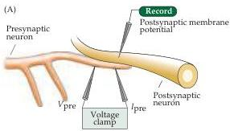
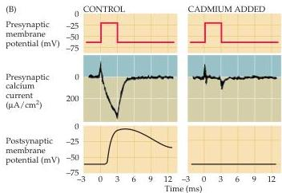

Synaptic Transmission

onds of this time.
As can be seen from the 1-millisecond delay in transmission following excitation of the presynaptic terminal (see Figure 5.6B), membrane fusion during exocytosis is much more rapid than budding during endocytosis.
Thus, all of the recycling steps interspersed between membrane budding and subsequent refusion of a vesicle are completed in less than a minute.

The precursors to synaptic vesicles originally are produced in the endoplasmic reticulum and Golgi apparatus in the neuronal cell body.
Because of the long distance between the cell body and the presynaptic terminal in most neurons, transport of vesicles from the soma would not permit rapid replenishment of synaptic vesicles during continuous neural activity.
Thus, local recycling is well suited to the peculiar anatomy of neurons, giving nerve terminals the means to provide a continual supply of synaptic vesicles.
As might be expected, defects in synaptic vesicle recycling can cause severe neurological disorders, some of which are described in Box B.

# The Role of Calcium in Transmitter Secretion

As was apparent in the experiments of Katz and others described in the preceding sections, lowering the concentration of  $\mathrm{Ca^{2+}}$  outside a presynaptic motor nerve terminal reduces the size of the EPP (compare Figure 5.6B and D).
Moreover, measurement of the number of transmitter quanta released under such conditions shows that the reason the EPP gets smaller is that lowering  $\mathrm{Ca^{2+}}$  concentration decreases the number of vesicles that fuse with the plasma membrane of the terminal.
An important insight into how  $\mathrm{Ca^{2+}}$  regulates the fusion of synaptic vesicles was the discovery that presynaptic terminals have voltage-sensitive  $\mathrm{Ca^{2+}}$  channels in their plasma membranes (see Chapter 4).

The first indication of presynaptic  $\mathrm{Ca^{2+}}$  channels was provided by Katz and Ricardo Miledi.
They observed that presynaptic terminals treated with tetrodotoxin (which blocks  $\mathrm{Na}^+$  channels; see Chapter 3) could still produce a peculiarly prolonged type of action potential.
The explanation for this surprising finding was that current was still flowing through  $\mathrm{Ca^{2+}}$  channels, substituting for the current ordinarily carried by the blocked  $\mathrm{Na}^+$  channels.
Subsequent voltage clamp experiments, performed by Rodolfo Llinás and others at a giant presynaptic terminal of the squid (Figure 5.10A), confirmed

Figure 5.10 The entry of  $\mathrm{Ca^{2+}}$  through the specific voltage-dependent calcium channels in the presynaptic terminals causes transmitter release.
(A) Experimental setup using an extraordinarily large synapse in the squid.
The voltage clamp method detects currents flowing across the presynaptic membrane when the membrane potential is depolarized.
(B) Pharmacological agents that block currents flowing through  $\mathrm{Na}^+$  and  $\mathrm{K}^+$  channels reveal a remaining inward current flowing through  $\mathrm{Ca^{2+}}$  channels.
This influx of calcium triggers transmitter secretion, as indicated by a change in the postsynaptic membrane potential.
Treatment of the same presynaptic terminal with cadmium, a calcium channel blocker, eliminates both the presynaptic calcium current and the postsynaptic response.
(After Augustine and Eckert, 1984.)