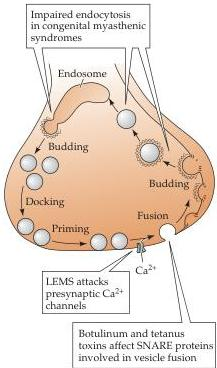

Chapter Five

# Box B

## Diseases That Affect the Presynaptic Terminal

Various steps in the exocytosis and endocytosis of synaptic vesicles are targets of a number of rare but debilitating neurological diseases.
Many of these are myasthenic syndromes, in which abnormal transmission at neuromuscular synapses leads to weakness and fatigability of skeletal muscles (see Box B in Chapter 7).
One of the best-understood examples of such disorders is the Lambert-Eaton myasthenic syndrome (LEMS), an occasional complication in patients with certain kinds of cancers.
Biopsies of muscle tissue removed from LEMS patients allow intracellular recordings identical to those shown in Figure 5.6.
Such recordings have shown that when a motor neuron is stimulated, the number of quanta contained in individual EPPs is greatly reduced, although the amplitude of spontaneous MEPPs is normal.
Thus, LEMS impairs evoked neurotransmitter release, but does not affect the size of individual quanta.

Several lines of evidence indicate that this reduction in neurotransmitter release is due to a loss of voltage-gated $\mathrm{Ca^{2+}}$ channels in the presynaptic terminal of motor neurons (see figure).
Thus, the defect in neuromuscular transmission can be overcome by increasing the extracellular concentration of $\mathrm{Ca^{2+}}$, and anatomical studies indicate a lower density of $\mathrm{Ca^{2+}}$ channel proteins in the presynaptic plasma membrane.
The loss of presynaptic $\mathrm{Ca^{2+}}$ channels in LEMS apparently arises from a defect in the immune system.
The blood of LEMS patients has a very high concentration of antibodies that bind to $\mathrm{Ca^{2+}}$ channels, and it seems likely that these antibodies are the primary cause of LEMS.
For example, removal of $\mathrm{Ca^{2+}}$ channel antibodies from the blood of LEMS patients by plasma exchange reduces muscle weakness.
Similarly, immunosuppressant drugs also can alleviate LEMS symptoms.
Perhaps most telling, injecting these antibodies into experimental animals elicits muscle weakness and abnormal neuromuscular transmission.
Why the immune system generates antibodies against $\mathrm{Ca^{2+}}$ channels is not clear.
Most LEMS patients have small-cell carcinoma, a form of lung cancer that may somehow initiate the immune response to $\mathrm{Ca^{2+}}$ channels.
Whatever the origin, the binding of antibodies to $\mathrm{Ca^{2+}}$ channels causes a reduction in $\mathrm{Ca^{2+}}$ channel currents.
It is this antibody-induced defect in presynaptic $\mathrm{Ca^{2+}}$ entry that accounts for the muscle weakness associated with LEMS.

Congenital myasthenic syndromes are genetic disorders that also cause muscle weakness by affecting neuromuscular transmission.
Some of these syndromes affect the acetylcholinesterase that degrades acetylcholine in the synaptic cleft, whereas others arise from autoimmune attack of acetylcholine receptors (see Box C in Chapter 6).
However, a number of congenital myasthenic syndromes arise from defects in acetylcholine release due to altered synaptic vesicle traffic within the motor neuron terminal.
Neuromuscular synapses in some of these patients have EPPs with reduced quantal content, a deficit that is especially prominent when the synapse is activated repeatedly.
Electron microscopy shows that presynaptic motor nerve terminals have a greatly reduced number of synaptic vesicles.
The defect in neurotransmitter release evidently results from an inadequate number of synaptic vesicles available for release during sustained presynaptic activity.
The origins of this shortage of synaptic vesicles is not clear, but could result either from an impairment in endocytosis in the nerve terminal (see figure) or from a reduced supply of vesicles from the motor neuron cell body.

Still other patients suffering from familial infantile myasthenia appear to have neuromuscular weakness that arises from reductions in the size of individual quanta, rather than the number of quanta released.
Motor nerve terminals from these patients have synaptic vesicles that are normal in number, but smaller in diameter.
This finding suggests a different type of genetic lesion that somehow alters formation of new synaptic vesicles following endocytosis, thereby leading to less acetylcholine in each vesicle.

Another disorder of synaptic transmitter release results from poisoning by anaerobic Clostridium bacteria.
This genus of microorganisms produces some

Presynaptic targets of several neurological disorders.