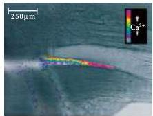
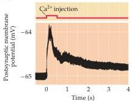
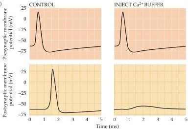

Chapter Five

Figure 5.11 Evidence that a rise in presynaptic  $\mathrm{Ca^{2+}}$  concentration triggers transmitter release from presynaptic terminals.
(A) Fluorescence microscopy measurements of presynaptic  $\mathrm{Ca^{2+}}$  concentration at the squid giant synapse (see Figure 5.8A).
A train of presynaptic action potentials causes a rise in  $\mathrm{Ca^{2+}}$  concentration, as revealed by a dye (called fura-2) that fluoresces more strongly when the  $\mathrm{Ca^{2+}}$  concentration increases.
(B) Microinjection of  $\mathrm{Ca^{2+}}$  into a squid giant presynaptic terminal triggers transmitter release, measured as a depolarization of the postsynaptic membrane potential.
(C) Microinjection of BAPTA, a  $\mathrm{Ca^{2+}}$  chelator, into a squid giant presynaptic terminal prevents transmitter release.
(A from Smith et al., 1993; B after Miledi, 1971; C after Adler et al., 1991.)

(A)

(C)

from motor neurons requires only a fraction of a millisecond (see Figure 5.6), release of neuropeptides require high-frequency bursts of action potentials for many seconds.
These differences in the rate of release probably arise from differences in the spatial arrangement of vesicles relative to presynaptic  $\mathrm{Ca^{2+}}$  channels.
This perhaps is most evident in cases where small molecules and peptides serve as co-transmitters (Figure 5.12).
Whereas the small, clear-core vesicles containing small-molecule transmitters are typically docked at the plasma membrane in advance of  $\mathrm{Ca^{2+}}$  entry, large dense core vesicles containing peptide transmitters are farther away from the plasma membrane (see Figure 5.5D).
At low firing frequencies, the concentration of  $\mathrm{Ca^{2+}}$  may increase only locally at the presynaptic plasma membrane, in the vicinity of open  $\mathrm{Ca^{2+}}$  channels, limiting release to small-molecule transmitters from the docked small, clear-core vesicles.
Prolonged high-frequency stimulation increases the  $\mathrm{Ca^{2+}}$  concentration throughout the presynaptic terminal, thereby inducing the slower release of neuropeptides.

# Molecular Mechanisms of Transmitter Secretion

Precisely how an increase in presynaptic  $\mathrm{Ca^{2+}}$  concentration goes on to trigger vesicle fusion and neurotransmitter release is not understood.
However, many important clues have come from molecular studies that have identified and characterized the proteins found on synaptic vesicles and their binding