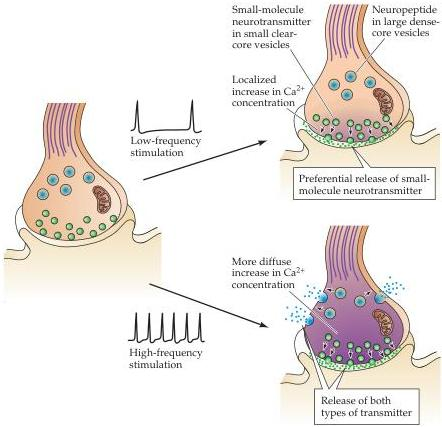

Synaptic Transmission

Figure 5.12 Differential release of neuropeptide and small-molecule co-transmitters.
Low-frequency stimulation preferentially raises the  $\mathrm{Ca^{2+}}$  concentration close to the membrane, favoring the release of transmitter from small clear-core vesicles docked at presynaptic specializations.
High-frequency stimulation leads to a more general increase in  $\mathrm{Ca^{2+}}$ , causing the release of peptide neurotransmitters from large dense-core vesicles, as well as small-molecule neurotransmitters from small clear-core vesicles.

partners on the presynaptic plasma membrane and cytoplasm (Figure 5.13).
Most, if not all, of these proteins act at one or more steps in the synaptic vesicle cycle.
Although a complete molecular picture of neurotransmitter release is still lacking, the roles of several proteins involved in vesicle fusion have been deduced.

Several of the proteins important for neurotransmitter release are also involved in other types of membrane fusion events common to all cells.
For example, two proteins originally found to be important for the fusion of vesicles with membranes of the Golgi apparatus, the ATPase NSF (NEM-sensitive fusion protein) and SNAPs (soluble NSF-attachment proteins), are also involved in priming synaptic vesicles for fusion.
These two proteins work by regulating the assembly of other proteins that are called SNAREs (SNAP receptors).
One of these SNARE proteins, synaptobrevin, is in the membrane of synaptic vesicles, while two other SNARE proteins called syntaxin and SNAP-25 are found primarily on the plasma membrane.
These SNARE proteins can form a macromolecular complex that spans the two membranes, thus bringing them into close apposition (Figure 5.14A).
Such an arrangement is well suited to promote the fusion of the two membranes, and several lines of evidence suggest that this is what actually occurs.
One important observation is that toxins that cleave the SNARE proteins block neurotransmitter release (Box C).
In addition, putting SNARE proteins into artificial lipid membranes and allowing these proteins to form complexes with each other causes the membranes to fuse.
Many other proteins, such as