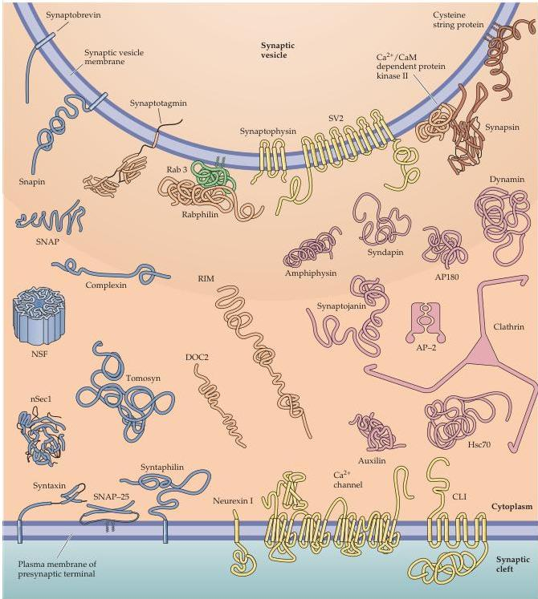

Chapter Five

$\mathrm{Ca^{2 + }}$  -binding proteins

SNARE-associated proteins

Proteins involved in endocytosis

Proteins that form channels, transporters, or receptors

GTP-binding proteins

Miscellaneous important proteins

Figure 5.13 Presynaptic proteins implicated in neurotransmitter release.
Structures adapted from Brunger (2001) and Brodsky et al.
(2001).