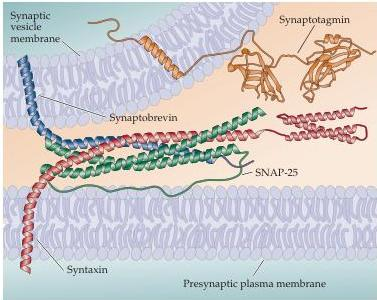
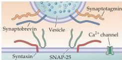
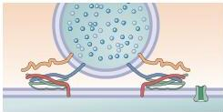
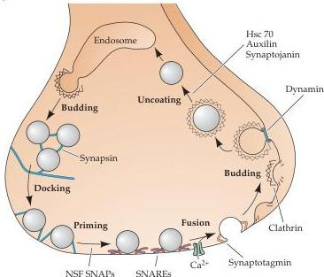
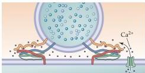
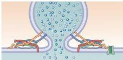
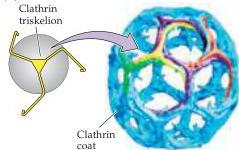

Chapter Five

(A)

(B)

(2) SNARE complexes form to pull membranes together

(C)

(3) Entering  $\mathrm{Ca^{2+}}$  binds to synaptotagmin

(4)  $\mathrm{Ca^{2+}}$ -bound synaptotagmin catalyzes membrane fusion

(D)
Figure 5.14 Molecular mechanisms of neurotransmitter release.
(A) Structure of the SNARE complex.
The vesicular SNARE, synaptobrevin (blue), forms a helical complex with the plasma membrane SNAREs syntaxin (red) and SNAP-25 (green).
Also shown is the structure of synaptotagmin, a vesicular  $\mathrm{Ca^{2+}}$ -binding protein.
(B) A model for  $\mathrm{Ca^{2+}}$ -triggered vesicle fusion.
SNARE proteins on the synaptic vesicle and plasma membranes form a complex (as in A) that brings together the two membranes.
 $\mathrm{Ca^{2+}}$  then binds to synaptotagmin, causing the cytoplasmic region of this protein to insert into the plasma membrane, bind to SNAREs and catalyze membrane fusion.
(C) Roles of presynaptic proteins in synaptic vesicle cycling.
(D) Individual clathrin triskelia (left) assemble together to form membrane coats (right) involved in membrane budding during endocytosis.
(A after Sutton et al., 1998; C after Sudhof, 1995; D after Marsh and McMahon, 2001.)