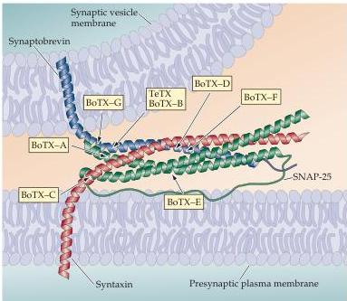

Synaptic Transmission

# Box C

# Toxins That Affect Transmitter Release

Several important insights about the molecular basis of neurotransmitter secretion have come from analyzing the actions of a series of biological toxins produced by a fascinating variety of organisms.
One family of such agents is the clostridial toxins responsible for botulism and tetanus (see Box B).
Clever and patient biochemical work has shown that these toxins are highly specific proteases that cleave presynaptic SNARE proteins (see figure).
Tetanus toxin and botulinum toxin (types B, D, F, and G) specifically cleave the vesicle SNARE protein, synaptobrevin.
Other botulinum toxins are proteases that cleave syntaxin (type C) and SNAP-25 (types A and E), SNARE proteins found on the presynaptic plasma membrane.
Destruction of these presynaptic proteins is the basis for the actions of the toxins on neurotransmitter release.
The evidence described in the text also implies that these three syn

aptic SNARE proteins are somehow important in the process of vesicle-plasma membrane fusion.

Another toxin that targets neurotransmitter release is  $\alpha$ -latrotoxin, a protein found in the venom of the female black widow spider.
Application of this molecule to neuromuscular synapses causes a massive discharge of synaptic vesicles, even when  $\mathrm{Ca^{2+}}$  is absent from the extracellular medium.
While it is not yet clear how this toxin triggers  $\mathrm{Ca^{2+}}$ -independent exocytosis,  $\alpha$ -latrotoxin binds to two different types of presynaptic proteins that may mediate its actions.
One group of binding partners for  $\alpha$ -latrotoxin is the neurexins, a group of integral membrane proteins found in presynaptic terminals (see Figure 5.13).
Several lines of evidence implicate binding to neurexins in at least some of the actions of  $\alpha$ -latrotoxin.
Because the neurexins bind to synaptotagmin, a vesicular  $\mathrm{Ca^{2+}}$ -binding

Cleavage of SNARE proteins by clostridial toxins.
Indicated are the sites of proteolysis by tetanus toxin (TeTX) and various types of botulinum toxin (BoTX).
(After Sutton et al., 1998.)

protein that is known to be important in exocytosis, this interaction may allow  $\alpha$ -latrotoxin to bypass the usual  $\mathrm{Ca^{2+}}$  requirement for triggering vesicle fusion.
Another type of presynaptic protein that can bind to  $\alpha$ -latrotoxin is called CL1 (based on its previous names,  $\mathrm{Ca^{2+}}$ -independent receptor for latrotoxin and latrophilin-1).
CL1 is a relative of the G-protein-coupled receptors that mediate the actions of neurotransmitters and other extracellular chemical signals (see Chapter 7).
Thus, the binding of  $\alpha$ -latrotoxin to CL1 is thought to activate an intracellular signal transduction cascade that may be involved in the  $\mathrm{Ca^{2+}}$ -independent actions of  $\alpha$ -latrotoxin.
While more work is needed to establish the roles of neurexins and CL1 in the actions of  $\alpha$ -latrotoxin definitively, effects on these two proteins probably account for the potent presynaptic actions of this toxin.

Still other toxins produced by snakes, snails, spiders, and other predatory animals are known to affect transmitter release, but their sites of action have yet to be identified.
Based on the precedents described here, it is likely that these biological poisons will continue to provide valuable tools for elucidating the molecular basis of neurotransmitter release, just as they will continue to enable the predators to feast on their prey.

# References

KRASNOPEROV, V.
G.
AND 10 OTHERS (1997)  $\alpha$ -Latrotoxin stimulates exocytosis by the interaction with a neuronal G-protein-coupled receptor.
Neuron 18: 925-937.
MONTECUCCO, C.
AND G.
SCHIAVO (1994) Mechanism of action of tetanus and botulinum neurotoxins.
Mol.
Microbiol.
13: 1-8.
SCHIAVO, G., M.
MATTEOLI AND C.
MONTECUCCO (2000) Neurotoxins affecting neuroexocytosis.
Physiol.
Rev.
80: 717-766.
SUGITA, S., M.
KHVOCHTEV AND T.
C.
SUDHOF (1999) Neurexins are functional  $\alpha$ -latrotoxin receptors.
Neuron 22: 489-496.