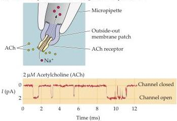
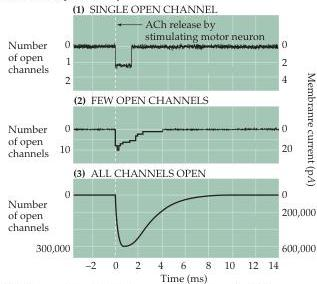
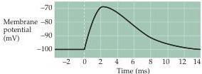

Synaptic Transmission

tials, the current reverses its polarity, becoming outward rather than inward (Figure 5.16C).
The potential where the EPC reverses, about  $0\mathrm{mV}$  in the case of the neuromuscular junction, is called the reversal potential.

As was the case for currents flowing through voltage-gated ion channels (see Chapter 3), the magnitude of the EPC at any membrane potential is given by the product of the ionic conductance activated by ACh  $(g_{\mathrm{ACh}})$  and the electrochemical driving force on the ions flowing through ligand-gated channels.
Thus, the value of the EPC is given by the relationship

$$
\mathrm {E P C} = g _ {\mathrm {A C h}} \left(V _ {\mathrm {m}} - E _ {\mathrm {r e v}}\right)
$$

where  $E_{\mathrm{rev}}$  is the reversal potential for the EPC.
This relationship predicts that the EPC will be an inward current at potentials more negative than  $E_{\mathrm{rev}}$  because the electrochemical driving force,  $V_{\mathrm{m}} - E_{\mathrm{rev}}$ , is a negative number.
Further, the EPC will become smaller at potentials approaching  $E_{\mathrm{rev}}$  because the driving force is reduced.
At potentials more positive than  $E_{\mathrm{rev}}$ , the EPC is outward because the driving force is reversed in direction (that is, positive).
Because the channels opened by ACh are largely insensitive to membrane voltage,  $g_{\mathrm{ACh}}$  will depend only on the number of channels opened by ACh, which depends in turn on the concentration of ACh in the synaptic cleft.

(A) Patch clamp measurement of single ACh receptor current

(B) Currents produced by:

Figure 5.15 Activation of ACh receptors at neuromuscular synapses.
(A) Outside-out patch clamp measurement of single ACh receptor currents from a patch of membrane removed from the postsynaptic muscle cell.
When ACh is applied to the extracellular surface of the membrane clamped at negative voltages, the repeated brief opening of a single channel can be seen as downward deflections corresponding to inward current (i.e., positive ions flowing into the cell).
(B) Synchronized opening of many ACh-activated channels at a synapse being voltage-clamped at negative voltages.
(1) If a single channel is examined during the release of ACh from the presynaptic terminal, the channel opens
(c) Postsynaptic potential change (EPP) produced by EPC

transiently.
(2) If a number of channels are examined together, ACh release opens the channels almost synchronously.
(3) The opening of a very large number of postsynaptic channels produces a macroscopic EPC.
(C) In a normal muscle cell (i.e., not being voltage-clamped), the inward EPC depolarizes the postsynaptic muscle cell, giving rise to an EPP.
Typically, this depolarization generates an action potential (not shown).