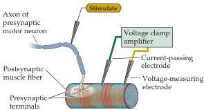
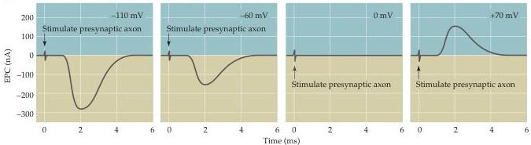
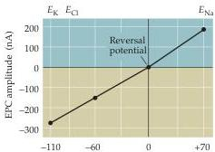
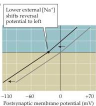
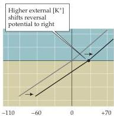

Chapter Five

Thus, the magnitude and polarity of the postsynaptic membrane potential determines the direction and amplitude of the EPC solely by altering the driving force on ions flowing through the receptor channels opened by ACh.

When $V_{\mathrm{m}}$ is at the reversal potential, $V_{\mathrm{m}} - E_{\mathrm{rev}}$ is equal to 0 and there is no net driving force on the ions that can permeate the receptor-activated channel.
As a result, the identity of the ions that flow during the EPC can be deduced by observing how the reversal potential of the EPC compares to the equilibrium potential for various ion species (Figure 5.17).
For example, if ACh were to open an ion channel permeable only to $K^{+}$, then the reversal

(A) Scheme for voltage clamping postsynaptic muscle fiber

Figure 5.16 The influence of the postsynaptic membrane potential on end plate currents.
(A) A postsynaptic muscle fiber is voltage clamped using two electrodes, while the presynaptic neuron is electrically stimulated to cause the release of ACh from presynaptic terminals.
This experimental arrangement allows the recording of macroscopic EPCs produced by ACh.
(B) Amplitude and time course of EPCs generated by stimulating the presynaptic motor neuron while the postsynaptic cell is voltage clamped at four different membrane potentials.
(C) The relationship between the peak amplitude of EPCs and postsynaptic membrane potential is nearly linear, with a reversal potential (the voltage at which the direction of the current changes from inward to outward) close to $0\mathrm{mV}$.
Also indicated on this graph are the equilibrium potentials of $\mathrm{Na^{+}}$, $\mathrm{K}^{+}$, and $\mathrm{Cl^{-}}$ ions.
(D) Lowering the external $\mathrm{Na^{+}}$ concentration causes EPCs to reverse at more negative potentials.
(E) Raising the external $\mathrm{K}^{+}$ concentration makes the reversal potential more positive.
(After Takeuchi and Takeuchi, 1960.)

(C)

(D)

(E)