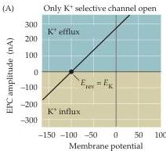
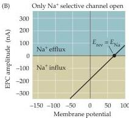
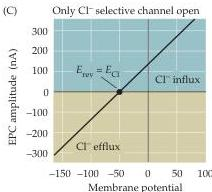
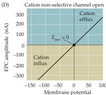

Synaptic Transmission

Figure 5.17 The effect of ion channel selectivity on the reversal potential.
Voltage clamping a postsynaptic cell while activating presynaptic neurotransmitter release reveals the identity of the ions permeating the postsynaptic receptors being activated.
(A) The activation of postsynaptic channels permeable only to  $\mathrm{K}^+$  results in currents reversing at  $E_{\mathrm{K}}$ , near  $-100\mathrm{mV}$ .
(B) The activation of postsynaptic  $\mathrm{Na}^+$  channels results in currents reversing at  $E_{\mathrm{Na}}$ , near  $+70\mathrm{mV}$ .
(C)  $\mathrm{Cl}^-$ -selective currents reverse at  $E_{\mathrm{Cl}}$ , near  $-50\mathrm{mV}$ .
(D) Ligand-gated channels that are about equally permeable to both  $\mathrm{K}^+$  and  $\mathrm{Na}^+$  show a reversal potential near  $0\mathrm{mV}$ .

