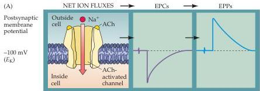
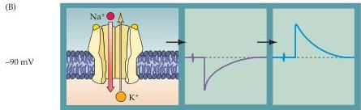
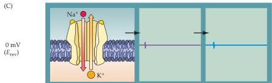
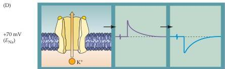
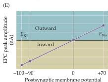
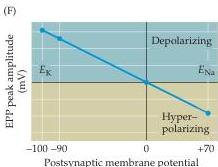

Chapter Five

Figure 5.18  $\mathrm{Na^{+}}$  and  $\mathbf{K}^+$  movements during EPCs and EPPs.
(A-D) Each of the postsynaptic potentials  $(V_{\mathrm{post}})$  indicated at the left results in different relative fluxes of net  $\mathrm{Na^{+}}$  and  $\mathbf{K}^+$  (ion fluxes).
These ion fluxes determine the amplitude and polarity of the EPCs, which in turn determine the EPPs.
Note that at about  $0\mathrm{mV}$  the  $\mathrm{Na^{+}}$  flux is exactly balanced by an opposite  $\mathbf{K}^+$  flux, resulting in no net current flow, and hence no change in the membrane potential.
(E) EPCs are inward currents at potentials more negative than  $E_{\mathrm{rev}}$  and outward currents at potentials more positive than  $E_{\mathrm{rev}}$ .
(F) EPPs depolarize the postsynaptic cell at potentials more negative than  $E_{\mathrm{rev}}$ .
At potentials more positive than  $E_{\mathrm{rev}}$ , EPPs hyperpolarize the cell.

5.18F).
However, at  $0\mathrm{mV}$ , the EPP reverses its polarity, and at more positive potentials, the EPP is hyperpolarizing.
Thus, the polarity and magnitude of the EPC depend on the electrochemical driving force, which in turn determines the polarity and magnitude of the EPP.
EPPs will depolarize when the membrane potential is more negative than  $E_{\mathrm{rev}}$ , and hyperpolarize when the membrane potential is more positive than  $E_{\mathrm{rev}}$ .
The general rule, then, is that