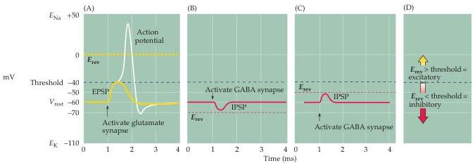

Chapter Five

Figure 5.19 Reversal potentials and threshold potentials determine postsynaptic excitation and inhibition.
(A) If the reversal potential for a PSP  $(0\mathrm{mV})$  is more positive than the action potential threshold  $(-40\mathrm{mV})$ , the effect of a transmitter is excitatory, and it generates EPSPs.
(B) If the reversal potential for a PSP is more negative than the action potential threshold, the transmitter is inhibitory and generate IPSPs.
(C) IPSPs can nonetheless depolarize the postsynaptic cell if their reversal potential is between the resting potential and the action potential threshold.
(D) The general rule of postsynaptic action is: If the reversal potential is more positive than threshold, excitation results; inhibition occurs if the reversal potential is more negative than threshold.

ing potential of the postsynaptic neuron is  $-60\mathrm{mV}$ , the resulting EPSP will depolarize by bringing the postsynaptic membrane potential toward  $0\mathrm{mV}$ .
For the hypothetical neuron shown in Figure 5.19A, the action potential threshold voltage is  $-40\mathrm{mV}$ .
Thus, a glutamate-induced EPSP will increase the probability that this neuron produces an action potential, defining the synapse as excitatory.

As an example of inhibitory postsynaptic action, consider a neuronal synapse that uses GABA as its transmitter.
At such synapses, the GABA receptors typically open channels that are selectively permeable to  $\mathrm{Cl^-}$  and the action of GABA causes  $\mathrm{Cl^-}$  to flow across the postsynaptic membrane.
Consider a case where  $E_{\mathrm{Cl}}$  is  $-70\mathrm{mV}$ , as is typical for many neurons, so that the postsynaptic resting potential of  $-60\mathrm{mV}$  is less negative than  $E_{\mathrm{Cl}}$ .
The resulting positive electrochemical driving force  $(V_{\mathrm{m}} - E_{\mathrm{rev}})$  will cause negatively charged  $\mathrm{Cl^-}$  to flow into the cell and produce a hyperpolarizing IPSP (Figure 5.19B).
This hyperpolarizing IPSP will take the postsynaptic membrane away from the action potential threshold of  $-40\mathrm{mV}$ , clearly inhibiting the postsynaptic cell.

Surprisingly, inhibitory synapses need not produce hyperpolarizing IPSPs.
For instance, if  $E_{\mathrm{Cl}}$  were  $-50\mathrm{mV}$  instead of  $-70\mathrm{mV}$ , then the negative electrochemical driving force would cause  $\mathrm{Cl^-}$  to flow out of the cell and produce a depolarizing IPSP (Figure 5.19C).
However, the synapse would still be inhibitory: Given that the reversal potential of the IPSP still is more negative than the action potential threshold  $(-40\mathrm{mV})$ , the depolarizing IPSP would inhibit because the postsynaptic membrane potential would be kept more negative than the threshold for action potential initiation.
Another way to think about this peculiar situation is that if another excitatory input onto this neuron brought the cell's membrane potential to  $-41\mathrm{mV}$ , just below threshold for firing an action potential, the IPSP would then hyperpolarize the membrane potential toward  $-50\mathrm{mV}$ , bringing the potential away from the action potential threshold.
Thus, while EPSPs depolarize the postsynaptic cell, IPSPs can hyperpolarize or depolarize; indeed, an inhibitory conductance change may produce no potential change at all and still exert an inhibitory effect by making it more difficult for an EPSP to evoke an action potential in the postsynaptic cell.

Although the particulars of postsynaptic action can be complex, a simple rule distinguishes postsynaptic excitation from inhibition: An EPSP has a reversal potential more positive than the action potential threshold, whereas