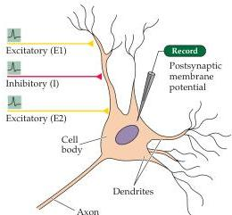
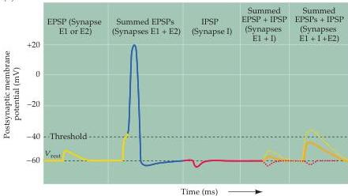

Synaptic Transmission

an IPSP has a reversal potential more negative than threshold (Figure 5.19D).
Intuitively, this rule can be understood by realizing that an EPSP will tend to depolarize the membrane potential so that it exceeds threshold, whereas an IPSP will always act to keep the membrane potential more negative than the threshold potential.

# Summation of Synaptic Potentials

The PSPs produced at most synapses in the brain are much smaller than those at the neuromuscular junction; indeed, EPSPs produced by individual excitatory synapses may be only a fraction of a millivolt and are usually well below the threshold for generating postsynaptic action potentials.
How, then, can such synapses transmit information if their PSPs are subthreshold? The answer is that neurons in the central nervous system are typically innervated by thousands of synapses, and the PSPs produced by each active synapse can sum together—in space and in time—to determine the behavior of the postsynaptic neuron.

Consider the highly simplified case of a neuron that is innervated by two excitatory synapses, each generating a subthreshold EPSP, and an inhibitory synapse that produces an IPSP (Figure 5.20A).
While activation of either one of the excitatory synapses alone (E1 or E2 in Figure 5.20B) produces a sub

(A)

(B)
Figure 5.20 Summation of postsynaptic potentials.
(A) A microelectrode records the postsynaptic potentials produced by the activity of two excitatory synapses (E1 and E2) and an inhibitory synapse (I).
(B) Electrical responses to synaptic activation.
Stimulating either excitatory synapse (E1 or E2) produces a subthreshold EPSP, whereas stimulating both synapses at the same time  $(\mathrm{E}1 + \mathrm{E}2)$  produces a suprathreshold EPSP that evokes a postsynaptic action potential (shown in blue).
Activation of the inhibitory synapse alone (I) results in a hyperpolarizing IPSP.
Summing this IPSP (dashed red line) with the EPSP (dashed yellow line) produced by one excitatory synapse  $(\mathrm{E}1 + \mathrm{I})$  reduces the amplitude of the EPSP (orange line), while summing it with the suprathreshold EPSP produced by activating synapses E1 and E2 keeps the postsynaptic neuron below threshold, so that no action potential is evoked.