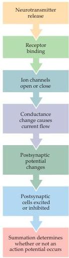

Chapter Five

Figure 5.21 Events from neurotransmitter release to postsynaptic excitation or inhibition.
Neurotransmitter release at all presynaptic terminals on a cell results in receptor binding, which causes the opening or closing of specific ion channels.
The resulting conductance change causes current to flow, which may change the membrane potential.
The postsynaptic cell sums (or integrates) all of the EPSPs and IPSPs, resulting in moment-to-moment control of action potential generation.

threshold EPSP, activation of both excitatory synapses at about the same time causes the two EPSPs to sum together.
If the sum of the two EPSPs (E1 + E2) depolarizes the postsynaptic neuron sufficiently to reach the threshold potential, a postsynaptic action potential results.
Summation thus allows subthreshold EPSPs to influence action potential production.
Likewise, an IPSP generated by an inhibitory synapse (I) can sum (algebraically speaking) with a subthreshold EPSP to reduce its amplitude  $(\mathrm{E}1 + \mathrm{I})$  or can sum with suprathreshold EPSPs to prevent the postsynaptic neuron from reaching threshold  $(\mathrm{E}1 + \mathrm{I} + \mathrm{E}2)$ .

In short, the summation of EPSPs and IPSPs by a postsynaptic neuron permits a neuron to integrate the electrical information provided by all the inhibitory and excitatory synapses acting on it at any moment.
Whether the sum of active synaptic inputs results in the production of an action potential depends on the balance between excitation and inhibition.
If the sum of all EPSPs and IPSPs results in a depolarization of sufficient amplitude to raise the membrane potential above threshold, then the postsynaptic cell will produce an action potential.
Conversely, if inhibition prevails, then the postsynaptic cell will remain silent.
Normally, the balance between EPSPs and IPSPs changes continually over time, depending on the number of excitatory and inhibitory synapses active at a given moment and the magnitude of the current at each active synapse.
Summation is therefore a neurotransmitter-induced tug-of-war between all excitatory and inhibitory postsynaptic currents; the outcome of the contest determines whether or not a postsynaptic neuron fires an action potential and, thereby, becomes an active element in the neural circuits to which it belongs (Figure 5.21).

# Two Families of Postsynaptic Receptors

The opening or closing of postsynaptic ion channels is accomplished in different ways by two broad families of receptor proteins.
The receptors in one family—called ionotropic receptors—are linked directly to ion channels (the Greek tropos means to move in response to a stimulus).
These receptors contain two functional domains: an extracellular site that binds neurotransmitters, and a membrane-spanning domain that forms an ion channel (Figure 5.22A).
Thus ionotropic receptors combine transmitter-binding and channel functions into a single molecular entity (they are also called ligand-gated ion channels to reflect this concatenation).
Such receptors are multimers made up of at least four or five individual protein subunits, each of which contributes to the pore of the ion channel.

The second family of neurotransmitter receptors are the metabotropic receptors, so called because the eventual movement of ions through a channel depends on one or more metabolic steps.
These receptors do not have ion channels as part of their structure; instead, they affect channels by the activation of intermediate molecules called G-proteins (Figure 5.22B).
For this reason, metabotropic receptors are also called G-protein-coupled receptors.
Metabotropic receptors are monomeric proteins with an extracellular domain that contains a neurotransmitter binding site and an intracellular domain that binds to G-proteins.
Neurotransmitter binding to metabotropic receptors activates G-proteins, which then dissociate from the receptor and interact directly with ion channels or bind to other effector proteins, such as enzymes, that make intracellular messengers that open or close ion channels.
Thus, G-proteins can be thought of as transducers that couple neurotransmitter binding to the regulation of postsynaptic ion channels.
The postsynaptic signaling events initiated by metabotropic receptors are taken up in detail in Chapter 7.