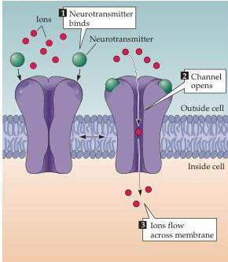
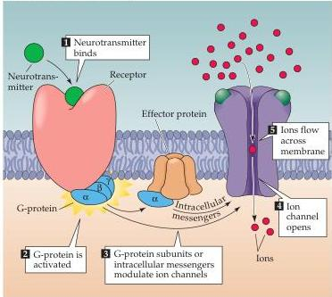

Synaptic Transmission

(A) Ligand-gated ion channels
Figure 5.22 A neurotransmitter can affect the activity of a postsynaptic cell via two different types of receptor proteins: ionotropic or ligand-gated ion channels, and metabotropic or G-protein-coupled receptors.
(A) Ligand-gated ion channels combine receptor and channel functions in a single protein complex.
(B) Metabotropic receptors usually activate G-proteins, which modulate ion channels directly or indirectly through intracellular effector enzymes and second messengers.

(B) G-protein-coupled receptors

These two families of postsynaptic receptors give rise to PSPs with very different time courses, producing postsynaptic actions that range from less than a millisecond to minutes, hours, or even days.
Ionotropic receptors generally mediate rapid postsynaptic effects.
Examples are the EPP produced at neuromuscular synapses by ACh (see Figure 5.15), EPSPs produced at certain glutamatergic synapses (Figure 5.19A), and IPSPs produced at certain GABAergic synapses (Figure 5.19B).
In all three cases, the PSPs arise within a millisecond or two of an action potential invading the presynaptic terminal and last for only a few tens of milliseconds or less.
In contrast, the activation of metabotropic receptors typically produces much slower responses, ranging from hundreds of milliseconds to minutes or even longer.
The comparative slowness of metabotropic receptor actions reflects the fact that multiple proteins need to bind to each other sequentially in order to produce the final physiological response.
Importantly, a given transmitter may activate both ionotropic and metabotropic receptors to produce both fast and slow PSPs at the same synapse.

Perhaps the most important principle to keep in mind is that the response elicited at a given synapse depends upon the neurotransmitter released and the postsynaptic complement of receptors and associated channels.
The molecular mechanisms that allow neurotransmitters and their receptors to generate synaptic responses are considered in the next chapter.