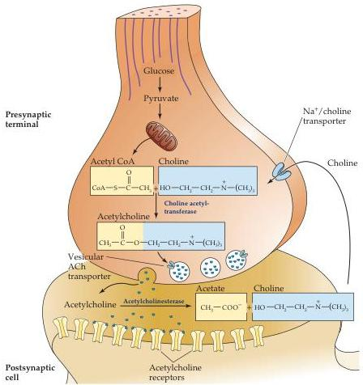

Chapter Six

Figure 6.2 Acetylcholine metabolism in cholinergic nerve terminals.
The synthesis of acetylcholine from choline and acetyl CoA requires choline acetyltransferase.
Acetyl CoA is derived from pyruvate generated by glycolysis, while choline is transported into the terminals via a  $\mathrm{Na^{+}}$ -dependent transporter.
Acetylcholine is loaded into synaptic vesicles via a vesicular transporter.
After release, acetylcholine is rapidly metabolized by acetylcholinesterase, and choline is transported back into the terminal.

transporter loads approximately 10,000 molecules of ACh into each cholinergic vesicle.

In contrast to most other small-molecule neurotransmitters, the postsynaptic actions of ACh at many cholinergic synapses (the neuromuscular junction in particular) is not terminated by reuptake but by a powerful hydrolytic enzyme, acetylcholinesterase (AChE).
This enzyme is concentrated in the synaptic cleft, ensuring a rapid decrease in ACh concentration after its release from the presynaptic terminal.
AChE has a very high catalytic activity (about 5000 molecules of ACh per AChE molecule per second) and hydrolyzes ACh into acetate and choline.
The choline produced by ACh hydrolysis is transported back into nerve terminals and used to resynthesize ACh.

Among the many interesting drugs that interact with cholinergic enzymes are the organophosphates.
This group includes some potent chemical warfare agents.
One such compound is the nerve gas "Sarin," which was made notorious after a group of terrorists released this gas in Tokyo's underground rail system.
Organophosphates can be lethal because they inhibit AChE, causing ACh to accumulate at cholinergic synapses.
This build-up of ACh depolarizes the postsynaptic cell and renders it refractory to subsequent ACh release, causing neuromuscular paralysis and other effects.
The high sensitivity of insects to these AChE inhibitors has made organophosphates popular insecticides.

Many of the postsynaptic actions of ACh are mediated by the nicotinic ACh receptor (nAChR), so named because the CNS stimulant, nicotine, also