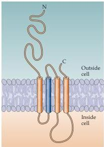
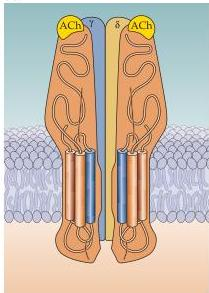
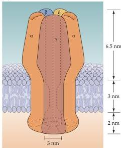
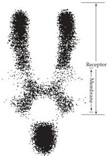

Neurotransmitters and Their Receptors 133

(A)

(B)

(C)

(D)

binds to these receptors.
Nicotine consumption produces some degree of euphoria, relaxation, and eventually addiction (Box A), effects believed to be mediated in this case by nAChRs.
Nicotinic receptors are the best-studied type of ionotropic neurotransmitter receptor.
As described in Chapter 5, nAChRs are nonselective cation channels that generate excitatory postsynaptic responses.
A number of biological toxins specifically bind to and block nicotinic receptors (Box B).
The availability of these highly specific ligands—particularly a component of snake venom called α-bungarotoxin—has provided a valuable way to isolate and purify nAChRs.
This pioneering work paved the way to cloning and sequencing the genes encoding the various subunits of the nAChR.

Based on these molecular studies, the nAChR is now known to be a large protein complex consisting of five subunits arranged around a central membrane-spanning pore (Figure 6.3).
In the case of skeletal muscle AChRs, the receptor pentamer contains two α subunits, each of which binds one molecule of ACh.
Because both ACh binding sites must be occupied for the channel to open, only relatively high concentrations of this neurotransmitter lead to channel activation.
These subunits also bind other ligands, such as nicotine and α-bungarotoxin.
At the neuromuscular junction, the two α subunits are combined with up to four other types of subunit—β, γ, δ, ε—in the ratio 2α:β:ε:δ.
Neuronal nAChRs typically differ from those of muscle in that they lack sensitivity to α-bungarotoxin.