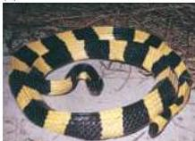
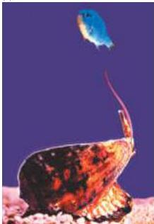
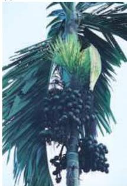

Chapter Six

# Box B

## Neurotoxins that Act on Postsynaptic Receptors

Poisonous plants and venomous animals are widespread in nature.
The toxins they produce have been used for a variety of purposes, including hunting, healing, mind-altering, and, more recently, research.
Many of these toxins have potent actions on the nervous system, often interfering with synaptic transmission by targeting neurotransmitter receptors.
The poisons found in some organisms contain a single type of toxin, whereas others contain a mixture of tens or even hundreds of toxins.

Given the central role of ACh receptors in mediating muscle contraction at neuromuscular junctions in numerous species, it is not surprising that a large number of natural toxins interfere with transmission at this synapse.
In fact, the classification of nicotinic and muscarinic ACh receptors is based on the sensitivity of these receptors to the toxic plant alkaloids nicotine and muscarine, which activate nicotinic and muscarinic ACh receptors, respectively.
Nicotine is derived from the dried leaves of the tobacco plant *Nicotinia tabacum*, and muscarine is from the poisonous red mushroom *Amanita muscaria*.
Both toxins are stimulants that produce nausea, vomiting, mental confusion, and convulsions.
Muscarine poisoning can also lead to circulatory collapse, coma, and death.

The poison α-bungarotoxin, one of many peptides that together make up the venom of the banded krait, *Bungarus multicinctus* (Figure A), blocks transmission at neuromuscular junctions and is used by the snake to paralyze its prey.
This 74-amino-acid toxin blocks neuromuscular transmission by irreversibly binding to nicotinic ACh receptors, thus preventing ACh from opening postsynaptic ion channels.
Paralysis ensues because skeletal muscles can no longer be activated by motor neurons.
As a result of its specificity and its high affinity for nicotinic ACh receptors, α-bungarotoxin has contributed greatly to understanding the ACh receptor molecule.
Other snake toxins that block nicotinic ACh receptors are cobra α-neurotoxin and the sea snake peptide erabutoxin.
The same strategy used by these snakes to paralyze prey was adopted by South American Indians who used curare, a mixture of plant toxins from *Chondodendron tomentosum*, as an arrowhead poison to immobilize their quarry.
Curare also blocks nicotinic ACh receptors; the active agent is the alkaloid δ-tubocurarine.

Another interesting class of animal toxins that selectively block nicotinic ACh and other receptors includes the peptides produced by fish-hunting marine cone snails (Figure B).
These colorful snails kill small fish by “shooting” venomous darts into them.
The venom contains hundreds of peptides, known as the conotoxins, many of which target proteins that are important in synaptic transmission.
There are conotoxin peptides that block Ca²⁺ channels, Na⁺ channels, glutamate receptors, and ACh

(A)

(B)

(C)

(A) The banded krait *Bungarus multicinctus*.
(B) A marine cone snail (*Conus* sp.) uses venomous darts to kill a small fish.
(C) Betel nuts, *Areca catechu*, growing in Malaysia.
(A, Robert Zappalorti/Photo Researchers, Inc.; B, Zoya Maslak and Baldomera Olivera, University of Utah; C, Fletcher Baylis/Photo Researchers, Inc.)