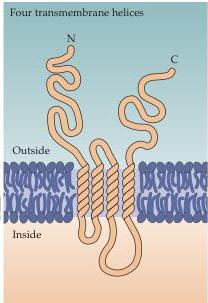
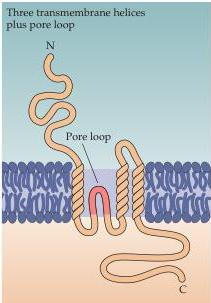
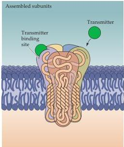

Chapter Six

(A)

(B)

(C)

|  Receptor | AMPA | NMDA | Kainate | GABA | Glycine | nACh | Serotonin | Purines  |
| --- | --- | --- | --- | --- | --- | --- | --- | --- |
|  Subunits (combi-nation of 4 or 5 required for each receptor type) | Glu R1 | NR1 | Glu R5 | α1-7 | α1 | α2-9 | 5-HT3 | P2X1  |
|   |  Glu R2 | NR2A | Glu R6 | β1-4 | α2 | β1-4 |  | P2X2  |
|   |  Glu R3 | NR2B | Glu R7 | γ1-4 | α3 | γ |  | P2X3  |
|   |  Glu R4 | NR2C | KA1 | δ | α4 | δ |  | P2X4  |
|   |   | NR2D | KA2 | ε | β |  |  | P2X5  |
|   |   |  |  | ρ1-3 |  |  |  | P2X6  |
|   |  |  |  |  |  |  |  | P2X7  |

Figure 6.4 The general architecture of ligand-gated receptors.
(A) One of the subunits of a complete receptor.
The long N-terminal region forms the ligand-binding site, while the remainder of the protein spans the membrane either four times (left) or three times (right).
(B) Assembly of either four or five subunits into a complete receptor.
(C) A diversity of subunits come together to form functional ionotropic neurotransmitter receptors.

terminals and metabolized to glutamate by the mitochondrial enzyme glutaminase (Figure 6.6).
Glutamate can also be synthesized by transamination of 2-oxoglutarate, an intermediate of the tricarboxylic acid cycle.
Hence, some of the glucose metabolized by neurons can also be used for glutamate synthesis.

The glutamate synthesized in the presynaptic cytoplasm is packaged into synaptic vesicles by transporters, termed VGLUT.
At least three different VGLUT genes have been identified.
Once released, glutamate is removed from the synaptic cleft by the excitatory amino acid transporters (EAATs).
There are five different types of high-affinity glutamate transporters exist, some of which are present in glial cells and others in presynaptic terminals.
Glutamate taken up by glial cells is converted into glutamine by the enzyme