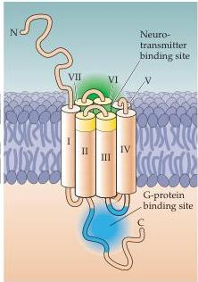

Neurotransmitters and Their Receptors 139

(A)
Figure 6.5 Structure and function of metabotropic receptors.
(A) The transmembrane architecture of metabotropic receptors.
These monomeric proteins contain seven transmembrane domains.
Portions of domains II, III, VI, and VII make up the neurotransmitter-binding region.
G-proteins bind to both the loop between domains V and VI and to portions of the C-terminal region.
(B) Varieties of metabotropic neurotransmitter receptors.

(B)

|  Receptor class | Glutamate | GABAB | Dopamine | NE, Epi | Histamine | Serotonin | Purines | Muscarinic  |
| --- | --- | --- | --- | --- | --- | --- | --- | --- |
|  Receptor subtype | Class I | GABAB R1 | D1A | α1 | H1 | 5-HT 1 | A type | M1  |
|   |  mGlu R1 | GABAB R2 | D1B | α2 | H2 | 5-HT 2 | A1 | M2  |
|   |  mGlu R5 |  | D2 | β1 | H3 | 5-HT 3 | A2a | M3  |
|   |  Class II |  | D3 | β2 |  | 5-HT 4 | A2b | M4  |
|   |  mGlu R2 |  | D4 | β3 |  | 5-HT 5 | A3 | M5  |
|   |  mGlu R3 |  |  |  |  | 5-HT 6 | P type |   |
|   |  Class III |  |  |  |  | 5-HT 7 | P2x |   |
|   |  mGlu R4 |  |  |  |  |  | P2y |   |
|   |  mGlu R6 |  |  |  |  |  | P2z |   |
|   |  mGlu R7 |  |  |  |  |  | P2t |   |
|   |  mGlu R8 |  |  |  |  |  | P2u |   |

glutamine synthetase; glutamine is then transported out of the glial cells and into nerve terminals.
In this way, synaptic terminals cooperate with glial cells to maintain an adequate supply of the neurotransmitter.
This overall sequence of events is referred to as the glutamate-glutamine cycle (see Figure 6.6).

Several types of glutamate receptors have been identified.
Three of these are ionotropic receptors called, respectively, NMDA receptors, AMPA receptors, and kainate receptors (Figure 6.4C).
These glutamate receptors are named after the agonists that activate them: NMDA (N-methyl-D-aspartate), AMPA (α-amino-3-hydroxyl-5-methyl-4-isoxazole-propionate), and kainic acid.
All of the ionotropic glutamate receptors are nonselective cation channels similar to the nAChR, allowing the passage of Na⁺ and K⁺, and in some cases small amounts of Ca²⁺.
Hence AMPA, kainate, and NMDA receptor activation always produces excitatory postsynaptic responses.
Like other ionotropic receptors, AMPA/kainate and NMDA receptors are also formed