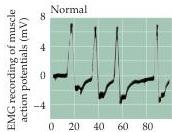
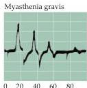
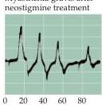
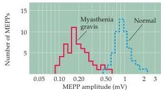

Chapter Six

# Box C

## Myasthenia Gravis: An Autoimmune Disease of Neuromuscular Synapses

Myasthenia gravis is a disease that interferes with transmission between motor neurons and skeletal muscle fibers and afflicts approximately 1 of every 200,000 people.
Originally described by the British physician Thomas Willis in 1685, the hallmark of the disorder is muscle weakness, particularly during sustained activity.
Although the course is variable, myasthenia commonly affects muscles controlling the eyelids (resulting in drooping of the eyelids, or ptosis) and eye movements (resulting in double vision, or diplopia).
Muscles controlling facial expression, chewing, swallowing, and speaking are other common targets.

An important indication of the cause of myasthenia gravis came from the clinical observation that the muscle weakness improves following treatment with inhibitors of acetylcholinesterase, the enzyme that normally degrades acetylcholine at the neuromuscular junction.
Studies of muscle obtained by biopsy from myasthenic patients showed that both end plate potentials (EPPs) and miniature end plate potentials (MEPPs) are much smaller than normal (see figure; also see Chapter 5).
Because both the frequency of MEPPs and the quantal content of EPPs are normal, it seemed likely that myasthenia gravis entails a disorder of the postsynaptic muscle cells.
Indeed, electron microscopy shows that the structure of neuromuscular junctions is altered, obvious changes being a widening of the synaptic cleft and an apparent reduction in the number of acetylcholine receptors in the postsynaptic membrane.

A chance observation in the early 1970s led to the discovery of the underlying cause of these changes.
Jim Patrick and Jon Lindstrom, then working at the Salk Institute, were attempting to raise antibodies to nicotinic acetylcholine receptors by immunizing rabbits with

(A)
(B)

Time (ms)

Myasthenia gravis after neostigmine treatment

(A) Myasthenia gravis reduces the efficiency of neuromuscular transmission.
Electromyographs show muscle responses elicited by stimulating motor nerves.
In normal individuals, each stimulus in a train evokes the same contractile response.
In contrast, transmission rapidly fatigues in myasthenic patients, although it can be partially restored by administration of acetylcholinesterase inhibitors such as neostigmine.
(B) Distribution of MEPP amplitudes in muscle fibers from myasthenic patients (solid line) and controls (dashed line).
The smaller size of MEPPs in myasthenics is due to a diminished number of postsynaptic receptors.
(A after Harvey et al., 1941; B after Elmqvist et al., 1964.)

the receptors.
Unexpectedly, the immunized rabbits developed muscle weakness that improved after treatment with acetylcholinesterase inhibitors.
Subsequent work showed that the blood of myasthenic patients contains antibodies directed against the acetylcholine receptor, and that these antibodies are present at neuromuscular synapses.
Removal of antibodies by plasma exchange improves the weakness.
Finally, injecting the serum of myasthenic patients into mice produces myasthenic effects (because the serum carries circulating antibodies).

These findings indicate that myasthenia gravis is an autoimmune disease that targets nicotinic acetylcholine receptors.
The immune response

reduces the number of functional receptors at the neuromuscular junction and can eventually destroys them altogether, diminishing the efficiency of synaptic transmission; muscle weakness thus occurs because motor neurons are less capable of exciting the postsynaptic muscle cells.
This causal sequence also explains why cholinesterase inhibitors alleviate the signs and symptoms of myasthenia: The inhibitors increase the concentration of acetylcholine in the synaptic cleft, allowing more effective activation of those postsynaptic receptors not yet destroyed by the immune system.

Despite all these insights, it is still not clear what triggers the immune system to produce an autoimmune