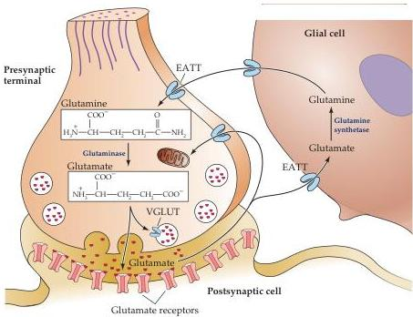

Neurotransmitters and Their Receptors 141

response to acetylcholine receptors.
Surgical removal of the thymus is beneficial in young patients with hyperplasia of the thymus, though precisely how the thymus contributes to myasthenia gravis is incompletely understood.
Many patients are treated with combinations of immunosuppression and cholinesterase inhibitors.

## References

ELMQVIST, D., W.
W.
HOFMANN, J.
KUGELBERG AND D.
M.
J.
QUASTEL (1964) An electrophysiological investigation of neuromuscular transmission in myasthenia gravis.
J.
Physiol.
(Lond.) 174: 417–434.

PATRICK, J.
AND J.
LINDSTROM (1973) Autoimmune response to acetylcholine receptor.
Science 180: 871–872.

VINCENT, A.
(2002) Unravelling the pathogenesis of myasthenia gravis.
Nature Rev.
Immunol.
2: 797–804.

from the association of several protein subunits that can combine in many ways to produce a large number of receptor isoforms (see Figure 6.4C).

NMDA receptors have especially interesting properties (Figure 6.7A).
Perhaps most significant is the fact that NMDA receptor ion channels allow the entry of $\mathrm{Ca^{2+}}$ in addition to monovalent cations such as $\mathrm{Na^{+}}$ and $\mathrm{K^{+}}$.
As a result, EPSPs produced by NMDA receptors can increase the concentration of $\mathrm{Ca^{2+}}$ within the postsynaptic neuron; the $\mathrm{Ca^{2+}}$ concentration change can then act as a second messenger to activate intracellular signaling cascades (see Chapter 7).
Another key property is that they bind extracellular $\mathrm{Mg^{2+}}$.
At hyperpolarized membrane potentials, this ion blocks the pore of the NMDA receptor channel.
Depolarization, however, pushes $\mathrm{Mg^{2+}}$ out of the pore, allowing other cations to flow.
This property provides the basis for a voltage-dependence to current flow through the receptor (dashed line in Figure 6.7B) and means that NMDA receptors pass cations (most notably $\mathrm{Ca^{2+}}$)

Figure 6.6 Glutamate synthesis and cycling between neurons and glia.
The action of glutamate released into the synaptic cleft is terminated by uptake into neurons and surrounding glial cells via specific transporters.
Within the nerve terminal, the glutamine released by glial cells and taken up by neurons is converted back to glutamate.
Glutamate is transported into cells via excitatory amino acid transporters (EATs) and loaded into synaptic vesicles via vesicular glutamate transporters (VGLUT).