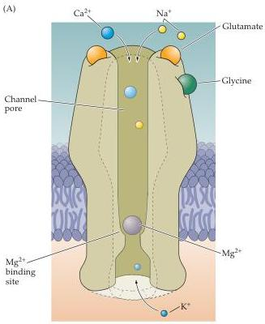
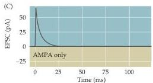
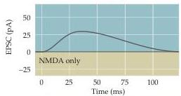
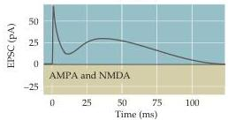
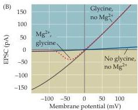

Chapter Six

Figure 6.7 NMDA and AMPA/kainate receptors.
(A) NMDA receptors contain binding sites for glutamate and the co-activator glycine, as well as an $\mathrm{Mg}^{2+}$-binding site in the pore of the channel.
At hyperpolarized potentials, the electrical driving force on $\mathrm{Mg}^{2+}$ drives this ion into the pore of the receptor and blocks it.
(B) Current flow across NMDA receptors at a range of postsynaptic voltages, showing the requirement for glycine, and $\mathrm{Mg}^{2+}$ block at hyperpolarized potentials (dotted line).
(C) The differential effects of glutamate receptor antagonists indicate that activation of AMPA or kainate receptors produces very fast EPSCs (top panel) and activation of NMDA receptors causes slower EPSCs (middle panel), so that EPSCs recorded in the absence of antagonists have two kinetic components due to the contribution of both types of response (bottom panel).

only during depolarization of the postsynaptic cell, due to either activation of a large number of excitatory inputs and/or by repetitive firing of action potentials in the presynaptic cell.
These properties are widely thought to be the basis for some forms of information storage at synapses, such as memory, as described in Chapter 24.
Another unusual property of NMRA receptors is that opening the channel of this receptor requires the presence of a coagonist, the amino acid glycine (Figure 6.7A,B).
There are at least five forms of NMDA receptor subunits (NMDA-R1, and NMDA-R2A through NMDA-R2D); different synapses have distinct combinations of these subunits, producing a variety of NMDA receptor-mediated postsynaptic responses.

Whereas some glutamatergic synapses have only AMPA or NMDA receptors, most possess both AMPA and NMDA receptors.
An antagonist of