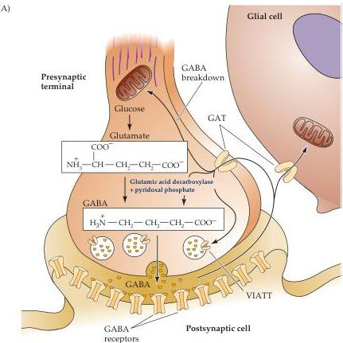
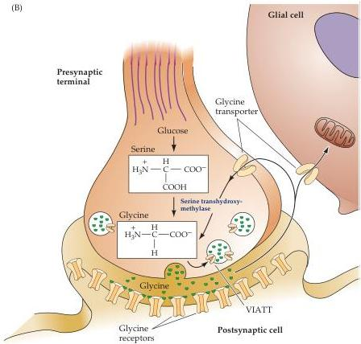

Chapter Six

Figure 6.8 Synthesis, release, and reuptake of the inhibitory neurotransmitters GABA and glycine.
(A) GABA is synthesized from glutamate by the enzyme glutamic acid decarboxylase, which requires pyridoxal phosphate.
(B) Glycine can be synthesized by a number of metabolic pathways; in the brain, the major precursor is serine.
High-affinity transporters terminate the actions of these transmitters and return GABA or glycine to the synaptic terminals for reuse, with both transmitters being loaded into synaptic vesicles via the vesicular inhibitory amino acid transporter (VIATT).

